<!-- Tip: Use /create-agent in chat to generate content with agent assistance -->

# Agent Instructions (Generic)

> Portable agent working agreement. Copy this file into any repository as `AGENTS.md`
> and adjust the **project-configurable** sections (marked with `⚙️`) to match the
> project. The rules that are not marked are intended to apply unchanged across projects.

---

## Core working model

The unit of work is a **feature** (also called a "story"). Each feature:

- Gets its own folder named after the feature, which holds **all** of its artifacts:
  requirements, plans, logs, scripts, and validation notes.
- May contain **sub-features**. Each sub-feature follows the exact same structure and
  rules as a feature, nested inside the parent feature folder.

### Feature folder structure

Create a folder per feature using a stable identifier (e.g. a ticket ID like `ABC-123`,
or a short kebab-case name if there is no tracker). The structure mirrors the parent:

```text
<feature-folder>/                              ← named after the feature / story
├── <feature-id>.md                            ← improved requirements & acceptance criteria
├── plans/                                     ← technical plans (one or more)
├── logs/                                      ← agent-created logs (mandatory)
├── scripts/                                   ← test / validation scripts for this feature
└── subfeatures/                               ← optional; same structure repeated
    └── <subfeature-id>/
        ├── <subfeature-id>.md
        ├── plans/
        ├── logs/
        └── scripts/
```

⚙️ **Project-configurable:** where feature folders live. By default, place them under a
dedicated working directory (for example `dev-notes/`, `work/`, or `.features/`). Pick one
location for the repository and keep it consistent. The requirements file, plans, and logs
always live **inside the feature folder**, never in `/tmp`, the repo root, or scattered
elsewhere.

---

## Step 0 — Session startup checks (run once per session)

Before doing any work, run the following checks in order.

### Step 0.1 — Documentation is up to date

⚙️ **Project-configurable docs location.** By default, all project documentation lives in
`docs/`. If this repository keeps docs elsewhere, adjust the path here.

Ask the developer:

> "Is the documentation in `docs/` up to date before we start?"

- If the answer is **no** or **uncertain**: stop and wait until the developer confirms
  the docs are current.
- If the answer is **yes**: continue.

### Step 0.2 — Detect available memory / index / search tooling

Memory, semantic-index, and code-search tools are **optional** and may not exist in every
repository. **Never assume they are available.** At the start of the session, detect what
is present, then adapt the rest of the workflow to whatever was found.

Check, in this order, and record which capabilities exist:

1. **Persistent memory tool** (e.g. an "aperio"-style recall/remember/wiki tool, or any
   equivalent long-term memory MCP server).
2. **Semantic code index** (e.g. a "qdrant"-style `search_code` / `index_codebase` tool,
   or any equivalent vector search MCP server).
3. **Richer search** (e.g. a "better-qdrant"-style search tool), if any.

How to detect:

- Inspect the available tool list for tools matching the capabilities above.
- If the project documents a vector/index stack (often via a container or compose
  service), verify that service is running before relying on it. If it is documented but
  not running, inform the developer and provide the documented startup steps before
  proceeding.

Then branch:

- **If memory/index tools ARE available:** follow the index-first research flow in the
  "Query interpretation" and "Feature research protocol" sections below.
- **If they are NOT available:** skip every index/memory step. Fall back to the built-in
  workspace tools (file search, text/grep search, semantic workspace search, and reading
  files directly). Do **not** block work waiting for tools that the project does not have.

State explicitly to the developer which mode you are in (e.g. "No memory/index tools
detected — using direct workspace search"). This sets expectations for the session.

### Step 0.3 — Index state check (only if an index tool exists)

This step applies **only when Step 0.2 found a semantic index tool**. If none exists, skip
it entirely.

- Check whether an index/collection already exists.
- If **no index exists** (first time): offer to build one before relying on semantic
  search.
- If an **index exists**: ask whether to re-index (recommended after significant code
  changes), offering an incremental re-index (faster) or a clean rebuild.
- If an **index exists and nothing changed** since the last session: proceed with the
  existing index.

Wait for the developer's decision before indexing.

---

## Session checklist (mandatory reads)

⚙️ **Project-configurable — fill this in per repository.** The list below is a generic
template. Replace the rows with the actual mandatory documents for this project. Match by
name/prefix so minor filename changes (suffixes, IDs) still resolve. If any listed file
cannot be found, stop and inform the developer before proceeding.

| Document                         | Path (edit per project)      |
| -------------------------------- | ---------------------------- |
| Project overview / README        | `README.md`                  |
| Architecture / design overview   | `docs/<architecture-doc>.md` |
| API / contract definitions       | `docs/<contracts-doc>.md`    |
| Coding & REST guidelines         | `docs/<guidelines-doc>.md`   |
| Environment / setup instructions | `docs/<setup-doc>.md`        |
| _(add or remove rows as needed)_ |                              |

After reading the listed files:

- Identify which paths are safe to modify (see "Allowed locations for changes").
- Read the current feature's requirements file: `<feature-folder>/<feature-id>.md`.
- Read all plan files: `<feature-folder>/plans/*.md`.
- Ensure `<feature-folder>/logs/` exists; create it if missing.
- When doubts arise about any technical aspect, treat `docs/` (or the project's documented
  doc location) as the authoritative reference and read it before asking.

---

## Query interpretation rule — memory and index first (when available)

**This rule applies only when Step 0.2 detected memory and/or index tooling.** When such
tools exist, any natural-language question or request should be silently reinterpreted as
a memory + index query before opening files or browsing the filesystem. Query the indexed
knowledge first; escalate to direct file reads only when the tools return insufficient
context.

### Mandatory resolution order (when tools exist)

Follow this waterfall and stop at the step that yields sufficient context:

```
1. Memory recall      → search persistent memory for the key concept(s)
2. Memory wiki/notes  → search stored notes/wiki pages for the same concept(s)
3. Semantic code search → 3–5 targeted queries against the indexed codebase
4. Richer search      → schemas, interfaces, edge-case patterns (if available)
5. Read specific files → only files identified by steps 1–4 as directly relevant
6. Read documentation → docs/ only if steps 1–5 are insufficient
```

Never jump to step 5 or 6 without exhausting steps 1–4. If steps 1–4 give enough context,
answer — do not open files just to "double-check."

### When tools return nothing (and when they don't exist)

- If memory/index tools exist but return nothing useful, say so explicitly, then ask the
  developer whether to read specific files directly, rebuild a stale index, or search the
  docs.
- If memory/index tools do **not** exist, use the built-in workspace search and
  file-reading tools directly. This is the normal, expected path for repositories without
  an index stack — not a fallback to apologize for.

---

## Feature research protocol

**Before opening source files, prefer search over speculative reading.** The exact tooling
depends on what Step 0.2 found:

- **With memory/index tools:** start from persistent memory, then run 3–5 semantic code
  searches covering the feature's main concepts, related services, and integration points.
  Read specific source files only when a search result points to a detail that needs
  closer inspection, a plan step requires it, or an inconsistency must be resolved by
  reading source directly.
- **Without memory/index tools:** use the built-in workspace tools — file search by
  name/pattern, text/grep search for exact symbols, and semantic workspace search — then
  read the specific files those searches surface.

In both modes: **always improve the requirements and save them as markdown inside the
feature folder** (`<feature-folder>/<feature-id>.md`). The improved requirements file is a
mandatory artifact regardless of which tooling is available. If memory tooling exists,
also persist the improved requirements there; if not, the markdown file in the feature
folder is the single source of truth.

Never read files purely to "orient yourself" when search can do it. If search returns
sufficient context to proceed, proceed.

---

## Planning rule (no code before plan)

**Not a single line of code may be written, modified, or deleted until a plan file exists
and covers that change.** This is absolute — no exceptions, no matter how small or obvious
the change appears.

- A feature may have more than one plan file. Each plan covers a specific scope or approach
  within the feature. All plan files live in `<feature-folder>/plans/` (or
  `<feature-folder>/subfeatures/<subfeature-id>/plans/`).
- Before writing any code, confirm the planned change is explicitly covered by an existing
  plan file. If it is not, create a new plan file first — then write the code.
- Every new plan file must include:
  - **Goal**: what this plan achieves relative to the feature.
  - **Approach**: architecture, patterns, key technical decisions.
  - **Steps**: ordered implementation steps with checkpoints.
  - **Files to be changed**: all files to create/modify.
  - **Risks / open questions**: anything uncertain or blocking.
- If requirements are too unclear to write a plan, read the project docs first. If
  uncertainty persists, stop and ask — never guess.
- Every code change, without exception, must be logged in `<feature-folder>/logs/`
  immediately after it is made — including minor fixes, typo corrections, and single-line
  changes. No code change is too small to log.

### Persist feature context (when memory tooling exists)

If Step 0.2 found a persistent memory tool, immediately after creating the requirements
file and all plan files — before writing any code and before asking for approval — store
the feature context in memory (improved requirements, the technical plan, and a one-line
summary). Update the stored plan whenever the plan changes after developer feedback. If no
memory tool exists, the markdown files in the feature folder are the durable record.

### Plan approval and implementation path

Once the requirements and plan files exist (and have been persisted to memory if a memory
tool is available), stop and ask the developer explicitly:

> "I have created the requirements and plan(s) for `<feature-id>`. Do you approve the plan?
>
> If yes — do you want to use **OpenSpec** to drive implementation (generating proposal,
> spec, design, and task artifacts from the plan before any code is written), or should I
> proceed **directly** with implementation following the plan?"

Do not write a single line of code until the developer gives explicit approval. If the
developer requests changes, update the plan file (and the persisted memory copy if any),
present the plan again, and wait for approval again. Only after explicit approval may
implementation begin.

- **OpenSpec chosen:** follow the OpenSpec flow below. The OpenSpec artifacts drive
  implementation — not the plan file directly.
- **Direct implementation chosen:** proceed following the plan file and all rules here.

For sub-features: each `<feature-folder>/subfeatures/<subfeature-id>/` must have its own
`plans/` and `logs/`, following the same rules.

---

## Handling inconsistencies

If you detect a conflict between what is requested or planned and what the project docs
specify, **do not proceed with any implementation**. Instead:

1. Create a file in the feature folder named `inconsistency-<short-description>.md`.
2. The file must contain:
   - A clear explanation of the conflict.
   - One or more Mermaid diagrams illustrating the divergence (current spec vs. requested
     behavior, data flow differences, conflicting contracts, etc.).
   - Two or more concrete resolution options with their trade-offs.
3. Present the file to the developer and wait for an explicit resolution before resuming.

---

## Logs (mandatory after every action)

- All implementation work for a feature must be recorded in `<feature-folder>/logs/`.
- After **every implementation action** (code change, decision, experiment, blocker,
  verification, etc.), create a new log file using this naming format:

  ```
  YYYY-MM-DD-HHMM-<feature-id>-<slug>.md
  ```

  - `YYYY-MM-DD` — date (ISO, zero-padded)
  - `HHMM` — 24h local time at the moment of writing, zero-padded (e.g. `0930`, `1445`)
  - `<feature-id>` — the feature or sub-feature identifier
  - `<slug>` — short kebab-case description of the action

  Examples: `2026-05-21-0930-ABC-123-initial-implementation.md`,
  `2026-05-21-1445-ABC-123-curl-validation.md`

  This format guarantees ascending chronological order within a single day.

- Each log entry must clearly state:
  - What was done and which files were created/modified.
  - Why those decisions/changes were made.
  - Any deviations from the plan and the reason.
  - Current state: in progress / blocked / done.

Sub-features also require their own logs under
`<feature-folder>/subfeatures/<subfeature-id>/logs/` and do not replace feature-level logs.

---

## Test and validation scripts

- Any helper script (bash, sh, zsh, etc.) used for manual testing or endpoint validation
  must be stored under `<feature-folder>/scripts/`.
- Do not place these scripts in `/tmp`, the project root, or anywhere outside the feature
  folder.
- Use a descriptive filename including the target environment when relevant
  (e.g. `curl-validation-local.sh`, `smoke-test-dev.sh`).
- For sub-features, place scripts under
  `<feature-folder>/subfeatures/<subfeature-id>/scripts/`.
- Reference the script path in the corresponding log entry so validation is reproducible.

---

## Scope boundaries

- Do not modify any code that is not strictly required by the current feature (and, if
  used, its defined sub-features).
- No out-of-scope refactors, improvements, drive-by fixes, or dependency changes unless
  explicitly required by the feature.
- If you find an out-of-scope issue, log it as an observation in
  `<feature-folder>/logs/` and leave the code unchanged.

---

## Allowed locations for changes

⚙️ **Project-configurable.** By default, **any path contained within the repository root
may be modified**. Tighten this per project if the repository has protected paths (for
example generated code, vendored dependencies, or infrastructure directories).

When a project defines protected paths, any change to them requires:

1. Stopping before modifying the file.
2. Explaining which file, what change, and why.
3. Waiting for explicit approval before proceeding.

---

## Naming and architecture conventions

⚙️ **Project-configurable — adjust to the project's language/stack.** Reasonable defaults:

| Target                       | Convention             |
| ---------------------------- | ---------------------- |
| Variables / functions        | `camelCase`            |
| Classes / Types / Interfaces | `PascalCase`           |
| Constants / env vars         | `SCREAMING_SNAKE_CASE` |
| Files                        | `kebab-case`           |
| DB tables / columns          | `snake_case`           |

General principles (keep regardless of stack):

- Keep controllers/handlers thin — business logic belongs in services.
- Validate all inputs at the boundary.
- Use proper status codes / error types; never return success while signaling an error in
  the body.
- Never swallow errors silently.

---

## Implementation philosophy — the lazy senior developer

Work like a **lazy senior developer**. Lazy means **efficient, not careless**. The best
code is the code never written. This philosophy reinforces the "no out-of-scope work" and
"no code before plan" rules above — it is how code gets written once a plan is approved.

### The ladder — stop at the first rung that holds

Before writing any code, stop at the first rung that satisfies the need:

1. **Does this need to be built at all?** (YAGNI) — if not, don't.
2. **Does the standard library already do this?** Use it.
3. **Does a native platform/framework feature cover it?** Use it.
4. **Does an already-installed dependency solve it?** Use it.
5. **Can this be one line?** Make it one line.
6. **Only then:** write the minimum code that works.

### Rules

- No abstractions that weren't explicitly requested.
- No new dependency if it can be avoided (this aligns with "no dependency changes unless
  explicitly required by the feature" in Scope boundaries).
- No boilerplate nobody asked for.
- Deletion over addition. Boring over clever. Fewest files possible.
- Question complex requests: "Do you actually need X, or does Y cover it?" Raise it with
  the developer rather than silently building the larger thing.
- When two standard-library approaches are the same size, pick the edge-case-correct one.
  Lazy means **less code, not the flimsier algorithm**.
- Mark intentional simplifications with a `SIMPLIFICATION:` comment. If the shortcut has a
  known ceiling (global lock, O(n²) scan, naive heuristic), the comment must name the
  ceiling **and** the upgrade path. Record the same simplification in the feature log.

### Design quality — DRY and SOLID

Laziness is about volume of code, never about discipline. Try your best to keep designs
**DRY** and **SOLID**:

- **DRY** — factor out genuine duplication; don't repeat the same knowledge in two places.
  But don't pre-abstract speculative "future" duplication — that violates YAGNI. Abstract
  on the _third_ real occurrence, not the first.
- **SOLID** — single responsibility per unit; open to extension without modifying stable
  code; substitutable implementations; small focused interfaces; depend on abstractions at
  real boundaries. Apply these where they reduce coupling, not as ceremony on trivial code.

DRY/SOLID and laziness resolve together: the simplest design that is also non-repetitive
and well-factored wins. If "more SOLID" means more speculative indirection, that's not
SOLID — it's over-engineering.

### Not lazy about

Never cut corners on:

- Input validation at trust boundaries.
- Error handling that prevents data loss.
- Security.
- Accessibility.
- Calibration that real hardware needs (the platform is never the spec ideal — a clock
  drifts, a sensor reads off).
- Anything explicitly requested.

### Leave one runnable check

Lazy code without its check is **unfinished**. Non-trivial logic must leave **one runnable
check** behind — the smallest thing that fails if the logic breaks (an assert-based
demo/self-check, or one small test file; no frameworks, no fixtures required for this
specific check). Trivial one-liners need no test. This complements — does not replace — the
project's full test suite required in the verification phase.

---

## OpenSpec usage (optional, approval-driven)

OpenSpec is **not mandatory**. The developer chooses whether to use it as part of the plan
approval question — do not ask about OpenSpec separately at any other point in the session.

When the developer selects OpenSpec at approval time, the plan file and all gathered
feature context are fed into the OpenSpec flow. The resulting artifacts then drive
implementation instead of the plan file directly.

### OpenSpec flow (when enabled)

1. **`/opsx:propose "<feature-name>"`** — feed it the codebase context and the plan file.
   Produces `openspec/changes/<feature-name>/` with `proposal.md`, `specs/`, `design.md`,
   and `tasks.md`. Review with the developer before proceeding.
2. **`/opsx:apply`** — implement according to `tasks.md`. Never skip the proposal step.
3. **`/opsx:archive`** — merge delta specs into `openspec/specs/` and move the change
   folder to `openspec/changes/archive/<date>-<feature-name>/`.

When OpenSpec artifacts exist, they take precedence over the plan file for implementation
steps. Extended commands (`/opsx:new`, `/opsx:verify`, `/opsx:sync`, etc.) may only be
used if enabled in the project's OpenSpec profile and explicitly instructed.

---

## Branches and commits

**Branches:**

```
feature/<feature-id>-description
fix/<feature-id>-description
hotfix/description
chore/description
```

**Commits (conventional commits):**

```
feat(scope): what changed
fix(scope): what changed
chore(scope): what changed
```

---

## Rebasing from main

Keep the working branch up to date with `main` via rebase. After a rebase, resolve all
conflicts before continuing — never leave a conflict unresolved.

### Conflict resolution rules

1. **Conflict is unrelated to the current feature** → accept what comes from `main`. Main
   is the source of truth for anything outside the current feature's scope.
2. **Conflict involves code owned by the current feature** → the current feature's changes
   take precedence over `main`.

### After resolving conflicts

- Review every resolved file to confirm the merge result is coherent — resolution is not
  complete just because the conflict markers are gone.
- Build/run the project after rebasing to confirm nothing is broken before resuming.
- Log the rebase and any conflicts resolved in `<feature-folder>/logs/`, including which
  files conflicted, which rule was applied (main wins / feature wins), and why.
- If a conflict is ambiguous — it touches feature code but the incoming change from `main`
  looks intentional and significant — stop and ask rather than guessing. Document the
  ambiguity in the log.

---

## Git push (explicit approval only)

Never run `git push` without explicit approval. Before any push:

1. Present a full summary: every file created/modified/deleted, what each change does, and
   the target branch.
2. Wait for explicit confirmation.

No silent pushes, no implied approval, no pushes embedded in automated steps.

---

## After implementation — verification

Implementation is only complete after verification. The exact commands vary per project.

⚙️ **Project-configurable.** Determine **how to build, run, lint, format, and test** from
the project's `README.md` (and any documented setup files). Use those commands rather than
assuming a stack. If the project runs in containers, follow the documented container
workflow; if it runs locally, follow the local one.

Complete the steps below in order:

### 1. Start / build and smoke-test

Ask the developer once whether the app/test environment is already running. If not, follow
the README's setup/run instructions (including any prerequisites such as environment
variables, VPN, or services) before starting. Confirm it starts without errors and the
implemented functionality behaves as expected.

### 2. Lint, format, and tests

Run the project's lint, format, and test commands (from the README) **only on files
created or modified by the current feature**. Do not fix, reformat, or touch files outside
the feature's scope, even if the tooling reports issues there — leave pre-existing
violations in unrelated files untouched. If lint/format changed story-owned files, re-run
and re-confirm the project still works.

**All tests and formatting checks for the feature's files must pass.** This is mandatory
for every project regardless of type.

### 3. API / curl validation (mandatory for backend projects)

If the project is a **backend / API** project, for every endpoint or workflow touched by
the feature, write and execute curl (or equivalent) requests against the locally running
backend using real parameters.

- Use actual IDs, payloads, and auth tokens valid for the local environment — no
  placeholders.
- Requests must cover the full workflow from the feature's requirements and acceptance
  criteria, not just isolated endpoints.
- Log all results in `<feature-folder>/logs/curl-validation.md`, containing for each
  request: the complete, untruncated command (headers, method, body), a plain-language
  explanation of what it tests and why, and the complete, untruncated prettified response.
  Never summarize or truncate. Include a pass/fail verdict per request, and a final
  summary of whether the workflow satisfies the acceptance criteria.

If the project is **not** a backend project, this step is replaced by the project's own
end-to-end / UI / integration checks as documented — and those, along with all tests and
formatting, must pass.

If any check reveals a regression or unexpected behavior, fix it before proceeding — do not
mark the feature complete with failing results.

### 4. Other-environment validation (optional)

After local validation passes, ask whether the changes are deployed to another environment
(dev/test/staging). If yes, re-run the same coverage against that environment's URL
(adjusting parameters as needed) and append the results under a clearly labeled section in
the validation log.

### 5. Archive implementation context (when memory tooling exists)

If a persistent memory tool is available, after validation passes, read the feature's log
files and store a consolidated implementation record (files changed, key decisions,
deviations, integration points, gotchas, and the validation verdict), plus durable summary
notes. If no memory tool exists, the feature folder's logs and validation file are the
durable record.

### 6. Final log entry

Add a final log entry to `<feature-folder>/logs/` summarizing:

- Verification steps performed and their outcomes.
- Any issues found and fixed during verification.
- Test/format results and (for backends) the curl validation verdict.
- Confirmation that memory archival was completed (if applicable).
- Confirmation that the feature is ready for review.

---

## Workflow overview

```mermaid
flowchart TD

    DevMsg(["Developer message"])

    subgraph BOOT ["Step 0 — Session startup (once per session)"]
        b0{"Docs up to date?"}
        b0 -->|no| bStop(["STOP — wait for update"])
        b0 -->|yes| b1["Detect memory / index / search tooling"]
        b1 --> b2{Tools available?}
        b2 -->|yes| b3["Index state check\n(build / reindex if needed)"]
        b2 -->|no| b4["Use built-in workspace search\n(file / grep / semantic)"]
        b3 --> b5["Read mandatory session docs"]
        b4 --> b5
    end

    DevMsg --> b0
    b5 --> r1

    subgraph RESEARCH ["Feature research"]
        r1["Search first\n(memory+index OR workspace tools)"]
        r1 --> r2["Improve requirements\nsave as <feature>/<id>.md"]
        r2 --> r3{Enough context?}
        r3 -->|yes| r4["Proceed to planning"]
        r3 -->|no| r5["Read specific files from hits"]
        r5 --> r4
    end

    r4 --> p1

    subgraph PLAN ["Planning — no code before plan"]
        p1["Create plan file(s)\nin <feature>/plans/"]
        p1 --> p2["Persist to memory (if available)"]
        p2 --> p3{Inconsistency?}
        p3 -->|yes| p4(["inconsistency-*.md\nwait for resolution"])
        p3 -->|no| p5["Present plan for approval"]
        p5 -->|changes| p1
        p5 -->|approved + OpenSpec| p6["opsx propose / apply / archive"]
        p5 -->|approved + direct| p7["Direct implementation"]
    end

    p6 --> i1
    p7 --> i1

    subgraph IMPL ["Implementation"]
        i1["Write code per plan / OpenSpec"]
        i1 --> i2["Log every change\nYYYY-MM-DD-HHMM-<id>-slug.md"]
        i2 --> i3{More steps?}
        i3 -->|yes| i1
        i3 -->|no| i4["Code complete"]
    end

    i4 --> v1

    subgraph VERIFY ["Verification (commands from README)"]
        v1["Build / run / smoke-test"]
        v1 --> v2["Lint + format + tests\n(feature files only)"]
        v2 --> v3{Backend?}
        v3 -->|yes| v4["Curl / API validation"]
        v3 -->|no| v5["Project e2e / UI / integration checks"]
        v4 --> v6{All pass?}
        v5 --> v6
        v6 -->|no, fix and log| v2
        v6 -->|yes| v7["Archive to memory (if available)"]
        v7 --> v8["Final log entry"]
    end

    v8 --> Done(["Feature ready for review"])
```


