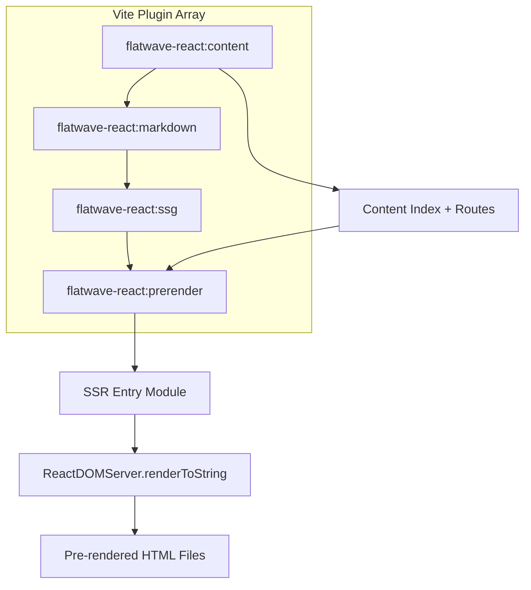
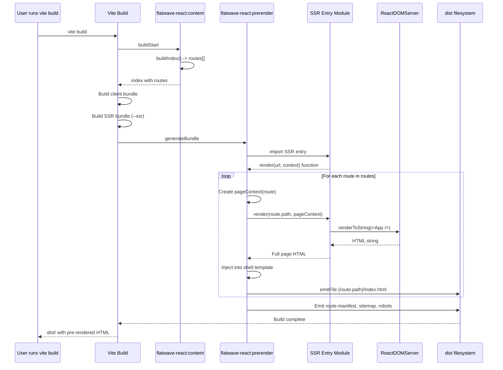

# Plan: Build-Time Pre-Rendering (SSG) Support for vite-plugin-flatwave-react

## Overview

This plan proposes adding build-time pre-rendering (Static Site Generation / SSG) support to the `vite-plugin-flatwave-react` plugin. Currently, the plugin generates static HTML shells with SEO metadata but no pre-rendered React content. The body content is rendered client-side only. This plan adds full pre-rendering so each route's HTML includes the fully rendered React component tree, enabling complete SEO compatibility.

---

## Current Architecture Analysis

### What Exists Today

**Plugin Structure** (`packages/vite-plugin-flatwave-react/src/index.ts`):
- `flatwave-react:content` - Builds content index, validates, exposes virtual module
- `flatwave-react:markdown` - Handles direct `.md` imports
- `flatwave-react:ssg` - Generates static assets in `generateBundle`:
  - `route-manifest.json`
  - `sitemap.xml`
  - `robots.txt`
  - HTML shells per route (empty `<div id="root"></div>`)

**Example App** (`examples/basic-react-site/src/App.tsx`):
- Client-side routing via `window.location.pathname`
- Uses virtual module `getRoutes()` and `getContent()`
- Renders `SimplePage` or `ProgramPage` components
- Markdown body rendered via `MarkdownRenderer` (react-markdown)

**Current Build Output**:
```html
<!-- dist/es/about/index.html -->
<!doctype html>
<html lang="es">
<head>
  <meta charset="UTF-8">
  <meta name="viewport" content="width=device-width, initial-scale=1.0">
  <title>Acerca de</title>
  <meta name="description" content="Página acerca del ejemplo Flatwave.">
  <link rel="canonical" href="/es/about">
  <!-- SEO tags, hreflang alternates -->
</head>
<body>
  <div id="root"></div>
  <script type="module" crossorigin src="/assets/index-XXX.js"></script>
</body>
</html>
```

### SEO Limitation

- **Good**: All metadata, canonical URLs, hreflang, sitemap, robots.txt present in static HTML
- **Weak**: Page body content (`<main>...</main>`) only appears after JavaScript executes
- **Impact**: Crawlers that don't execute JS see empty page bodies

---

## Research Findings: Best Practices

### Vite Native SSR (from vite.dev/guide/ssr)
- Use `vite.ssrLoadModule('/src/entry-server.js')` in dev
- Build with `vite build --ssr src/entry-server.js` for production
- Server entry exports `render(url)` returning rendered HTML string
- Uses `ReactDOMServer.renderToString()` or streaming `renderToPipeableStream()`

### Vike (vite-plugin-ssr) Pre-Rendering
- Enable with `ssr({ prerender: true })` in vite.config
- Uses `prerender()` hook to list URLs for parameterized routes
- Generates static HTML at `dist/client/`
- Supports partial pre-rendering + SPA for dynamic pages

### React 18 SSR Best Practices
- Use `ReactDOMServer.renderToPipeableStream()` for streaming
- Use `import.meta.env.SSR` for conditional server/client code
- Hydration with `ReactDOM.hydrateRoot()`
- `isomorphic` entry points: `.server.jsx` + `.client.jsx`

### Key Requirements for Our Plugin
1. **Content-driven routes** - Routes known at build time from Markdown index
2. **Locale-aware rendering** - Each locale variant pre-rendered separately
3. **Data availability at build time** - Content already in virtual module/index
4. **Component mapping** - Frontmatter `component` field maps to React components
5. **No runtime data fetching** - All content static, no async data needed

---

## Proposed Architecture

### High-Level Design

```mermaid
flowchart TD
    A[Vite Build Start] --> B[Content Plugin: buildIndex]
    B --> C[Route Inventory: routes[]]
    C --> D[Pre-render Plugin]
    
    subgraph PreRender[Pre-Render Pipeline]
        D --> E[Load SSR Entry Module]
        E --> F[For each route]
        F --> G[Create Page Context]
        G --> H[Render React to String]
        H --> I[Inject into HTML Shell]
        I --> J[Emit Pre-rendered HTML]
    end
    
    J --> K[dist/{locale}/{route}/index.html]
    K --> L[Static Host Deploy]
    
    C --> M[Existing: route-manifest.json]
    C --> N[Existing: sitemap.xml]
    C --> O[Existing: robots.txt]
```

### Plugin Architecture Extension



### Sequence Diagram: Build-Time Pre-Rendering



### SSR Entry Module Structure

```mermaid
flowchart LR
    subgraph SSR[entry-server.tsx]
        A[import App]
        B[import { getRoutes, getContent } from 'virtual:flatwave/content']
        C[export async function render(url, pageContext)]
        D[route = findRoute(url)]
        E[content = getContent(route.contentId, route.locale)]
        F[component = resolveComponent(content.component)]
        G[html = renderToString(<App route={route} content={content} />)]
        H[return html]
    end
    
    A --> C
    B --> C
    C --> D
    D --> E
    E --> F
    F --> G
    G --> H
```

---

## Configuration Design

### New Options

```typescript
interface FlatwaveContentOptions {
  // ...existing options
  
  /** Enable build-time pre-rendering (SSG) */
  prerender?: boolean | PrerenderOptions;
  
  /** SSR entry point for pre-rendering */
  ssrEntry?: string; // default: 'src/entry-server.tsx'
}

interface PrerenderOptions {
  /** Routes to pre-render (default: all public routes) */
  routes?: string[] | ((routes: FlatwaveRoute[]) => Route[]) => string[]);
  
  /** Skip pre-rendering for specific routes */
  exclude?: string[];
  
  /** Enable streaming render for faster TTFB */
  stream?: boolean;
  
  /** Custom HTML template (uses index.html by default) */
  template?: string;
}
```

### Default Configuration

```typescript
// vite.config.ts
import { flatwaveContent } from 'vite-plugin-flatwave-react';

export default defineConfig({
  plugins: [
    react(),
    flatwaveContent({
      contentDir: path.resolve(__dirname, 'src/content'),
      locales: ['es', 'pt'],
      defaultLocale: 'es',
      prerender: true, // or { exclude: ['/admin/*'] }
      ssrEntry: 'src/entry-server.tsx',
    }),
  ],
  // SSR build config
  build: {
    ssr: true,
  },
});
```

---

## Implementation Phases

### Phase 1: Core Pre-Render Infrastructure (Week 1-2)

**Tasks:**
1. Create `packages/vite-plugin-flatwave-react/src/prerender/` module
2. Add `flatwave-react:prerender` plugin to plugin array
3. Implement SSR entry loading via `vite.ssrLoadModule` (dev) and dynamic import (build)
4. Create default `entry-server.tsx` template
5. Add `renderRouteHtml` enhancement to inject pre-rendered HTML

**Files to Create:**
- `src/prerender/index.ts` - Main pre-render plugin
- `src/prerender/renderer.ts` - SSR rendering logic
- `src/prerender/template.ts` - HTML template handling
- `templates/entry-server.tsx` - Default SSR entry template

**Files to Modify:**
- `src/index.ts` - Add pre-render plugin, new options
- `src/types.ts` - Add `PrerenderOptions` type
- `package.json` - Add `react-dom/server` to peerDependencies

### Phase 2: Component Resolution & Data Injection (Week 2-3)

**Tasks:**
1. Create component registry from `componentsDir`
2. Implement `resolveComponent(name)` in SSR entry
3. Pass content data to page context
4. Handle component-specific props (date, schedule, etc.)
5. Ensure Markdown body available for pre-render

**Files to Create:**
- `src/prerender/component-registry.ts`
- `templates/entry-server.tsx` - Enhanced with component resolution

**Files to Modify:**
- `src/prerender/renderer.ts` - Pass component registry

### Phase 3: HTML Template & Streaming (Week 3-4)

**Tasks:**
1. Parse `index.html` as template with `<!--app-html-->` placeholder
2. Implement streaming render option (`renderToPipeableStream`)
3. Add `<head>` tag injection for per-page SEO
4. Ensure proper hydration attributes (`data-hydration`)

**Files to Modify:**
- `src/prerender/template.ts`
- `src/prerender/renderer.ts`

### Phase 4: Configuration & Integration (Week 4-5)

**Tasks:**
1. Add `prerender` option validation
2. Add `ssrEntry` option with default
3. Update Vite config in example app
4. Add `prerender` script to package.json
5. Test with example app

**Files to Modify:**
- `src/types.ts` - Extended types
- `src/index.ts` - Option normalization
- `examples/basic-react-site/vite.config.ts`
- `examples/basic-react-site/package.json`
- `examples/basic-react-site/src/entry-server.tsx`

### Phase 5: Testing & Documentation (Week 5-6)

**Tasks:**
1. Unit tests for pre-render module
2. E2E test verifying pre-rendered HTML contains body content
3. Verify hydration works in browser
4. Update documentation
5. Performance benchmarks

**Files to Create/Modify:**
- `tests/prerender.test.ts`
- `e2e/prerender.test.ts`
- `docs/Pre-Rendering-Guide.md`
- Update `README.md`

---

## Detailed Technical Design

### 1. Pre-Render Plugin (`src/prerender/index.ts`)

```typescript
import type { Plugin } from 'vite';
import { createRenderer } from './renderer.js';
import { loadTemplate } from './template.js';

export function createPrerenderPlugin(
  options: NormalizedOptions,
  index: FlatwaveContentIndex
): Plugin {
  let renderer: ReturnType<typeof createRenderer>;
  let template: string;

  return {
    name: 'flatwave-react:prerender',
    enforce: 'post',
    async buildStart() {
      // Load SSR entry module
      renderer = await createRenderer(options.ssrEntry);
      template = await loadTemplate(options.template);
    },
    async generateBundle(_, bundle) {
      if (!options.prerender) return;
      
      const routes = index.routes.filter(r => shouldPrerender(r, options));
      const assets = extractAssets(bundle);
      
      for (const route of routes) {
        const pageContext = createPageContext(route, index);
        const appHtml = await renderer.render(route.path, pageContext);
        const fullHtml = injectIntoTemplate(template, appHtml, route, assets);
        
        this.emitFile({
          type: 'asset',
          fileName: `${route.path.replace(/^\//, '').replace(/\/$/, '')}/index.html`,
          source: fullHtml,
        });
      }
    },
  };
}
```

### 2. SSR Entry Template (`templates/entry-server.tsx`)

```tsx
import { renderToString } from 'react-dom/server';
import { getRoutes, getContent } from 'virtual:flatwave/content';
import type { FlatwaveRoute, FlatwaveContentEntry } from 'vite-plugin-flatwave-react/types';

// Component registry - populated at build time
const components: Record<string, React.ComponentType<any>> = {};

export function registerComponent(name: string, component: React.ComponentType<any>) {
  components[name] = component;
}

export async function render(url: string, pageContext: PageContext) {
  const routes = getRoutes(pageContext.locale);
  const route = routes.find(r => r.path === url);
  
  if (!route) {
    throw new Error(`Route not found: ${url}`);
  }
  
  const content = getContent(route.contentId, pageContext.locale);
  if (!content) {
    throw new Error(`Content not found: ${route.contentId}`);
  }
  
  const Component = components[content.component] || SimplePage;
  
  // Create App with pre-loaded data (no client-side routing needed)
  const App = () => (
    <html lang={route.locale}>
      <head>
        <meta charSet="UTF-8" />
        <meta name="viewport" content="width=device-width, initial-scale=1.0" />
        <title>{route.metadata.title}</title>
        {renderHtmlHead(route)}
      </head>
      <body>
        <div id="root">
          <Component content={content} />
          <div dangerouslySetInnerHTML={{ __html: content.body }} />
        </div>
      </body>
    </html>
  );
  
  return renderToString(<App />);
}

// Helper to allow dynamic component registration
if (import.meta.hot) {
  import.meta.hot.accept();
}
```

### 3. Component Registry (`src/prerender/component-registry.ts`)

```typescript
import { discoverComponents } from '../content/validator.js';

export interface ComponentRegistry {
  [name: string]: React.ComponentType<any>;
}

export async function buildComponentRegistry(
  componentsDir?: string | string[]
): Promise<ComponentRegistry> {
  const componentNames = await discoverComponents(componentsDir);
  const registry: ComponentRegistry = {};
  
  // Dynamic import each component
  for (const name of componentNames) {
    try {
      const module = await import(`../components/${name}`);
      registry[name] = module.default || module[name];
    } catch {
      console.warn(`Component ${name} not found`);
    }
  }
  
  return registry;
}
```

---

## Migration Strategy

### Backward Compatibility

1. **Default behavior unchanged** - `prerender: false` by default
2. **Existing projects work** - No breaking changes to API
3. **Opt-in pre-rendering** - Users enable via config

### Migration Path for Users

```typescript
// Before (current)
flatwaveContent({ contentDir: 'src/content', locales: ['es', 'pt'] });

// After (opt-in pre-rendering)
flatwaveContent({ 
  contentDir: 'src/content', 
  locales: ['es', 'pt'],
  prerender: true,
  ssrEntry: 'src/entry-server.tsx', // optional, has default
});
```

### Required User Changes

1. Add `src/entry-server.tsx` (generated from template)
2. Export components for SSR (default export)
3. Ensure components work with SSR (no `window` access at module level)

---

## Risks & Mitigations

| Risk | Impact | Mitigation |
|------|--------|------------|
| SSR bundle size | Large bundle affects build time | Code splitting, externalize deps |
| Component SSR incompatibility | Hydration mismatch | Document SSR-safe patterns, warn on `window` access |
| Build time increase | Slower CI/CD | Parallel pre-rendering, caching |
| Memory usage | Large sites OOM | Stream rendering, batch processing |
| Data fetching complexity | Can't fetch at build time | All data already in content index |

---

## Success Criteria

1. **SEO Complete**: `curl /es/about` returns HTML with full page body
2. **Hydration Works**: Page becomes interactive after JS loads
3. **Performance**: Build time < 2x current build time
4. **Compatibility**: Existing example app works with `prerender: true`
5. **HMR**: Dev server still works (pre-render only in build)

---

## Open Questions

1. **Streaming vs String Rendering**: Start with `renderToString`, add streaming later?
2. **Partial Pre-Rendering**: Support `exclude` patterns for dynamic routes?
3. **Component Props**: How to pass component-specific frontmatter (date, schedule)?
4. **Markdown Rendering**: Use `react-markdown` in SSR or pre-render to HTML?
5. **Image Optimization**: Handle `` in Markdown for SSR?

---

## References

- [Vite SSR Guide](https://vite.dev/guide/ssr.html)
- [Vike Pre-Rendering](https://vike.dev/pre-rendering)
- [React 18 SSR](https://react.dev/reference/react-dom/server)
- [Vite Plugin API](https://vite.dev/guide/api-plugin.html)
- Current plugin: `packages/vite-plugin-flatwave-react/src/index.ts`
- Example app: `examples/basic-react-site/`