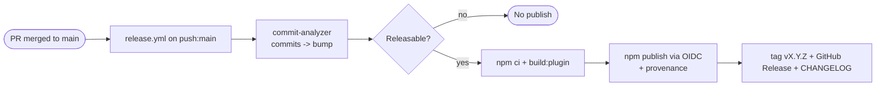

# Plan 0001 — Conventional-Commits auto-versioning + OIDC tokenless publish

- **Feature:** `publish-to-npm`
- **Status:** Approved — in implementation on branch `feat/publish-to-npm`
- **Created:** 2026-06-16 18:44 -05
- **Requirements:** `dev-notes/publish-to-npm/publish-to-npm.md`

## Goal

Replace the current *patch-only + token* release path with an automated release that, on
merge to `main`, derives the next version from **Conventional Commits**, publishes
`vite-plugin-flatwave-react` to npm (public, with provenance) using **OIDC Trusted
Publishing** (no `NPM_TOKEN`), and produces a tag, GitHub Release, and changelog. Satisfies
FR1–FR8 / AC1–AC8.

## Approach

### Tool choice (recommendation: `semantic-release`)

`semantic-release` runs on every push to `main`, analyzes commits, computes the next
semver, publishes, tags, creates the GitHub Release, and writes the changelog — in one CI
job, with **no version commit churn** in the repo. This matches the requirement "every
merge to `main` → npm updates" most directly, and its `@semantic-release/npm` plugin
supports `--provenance`.

Recommended plugin chain (all first-party):
- `@semantic-release/commit-analyzer` — commits → bump level
- `@semantic-release/release-notes-generator` — changelog text
- `@semantic-release/changelog` — write `CHANGELOG.md`
- `@semantic-release/npm` — set version + `npm publish` (provenance)
- `@semantic-release/github` — GitHub Release + tag
- `@semantic-release/git` — commit the changelog/`package.json` back (optional; uses `[skip ci]`)

**Alternative — `release-please`** (documented, not chosen unless approved): maintains a
"release PR"; publishing happens on a separate `release: published` job that runs vanilla
`npm publish` (cleanest OIDC fit, sidesteps R1). Trade-off: releases occur when the release
PR is merged, not on every feature merge.

### Auth — OIDC Trusted Publishing

- CI uses `permissions: id-token: write` (already present) and **no** `NODE_AUTH_TOKEN`.
- Requires npm CLI ≥ 11.5.1 in the runner (the workflow already installs `npm@latest`).
- A **Trusted Publisher** is configured on npmjs.com for the package, pointing at
  `kamansoft/vite-plugin-flatwave-react` and the release workflow file.
- **R1 mitigation:** if `semantic-release` cannot run token-less (its `verifyConditions`
  step), choose one of: (a) `release-please` alternative, (b) a short-lived token only for
  the bootstrap, then OIDC, (c) pin/configure `@semantic-release/npm` versions known to
  support OIDC. Decision recorded in the implementation log.

### First-publish bootstrap (FR8 / R2)

Because trusted publishing typically needs the package to exist:
1. One-time publish of the initial version to claim the name (either a manual local
   `npm publish --access public`, or a single CI run using a temporary token).
2. Configure the trusted publisher on npm.
3. Remove any temporary token; subsequent releases are OIDC-only.

## Steps (ordered, each logged when executed)

1. **Confirm tool choice** (`semantic-release` vs `release-please`) at approval.
2. **Add release config + dev deps** for the plugin package (release config file +
   `semantic-release` plugin chain in `devDependencies`); update `package-lock.json`.
3. **Rewrite `.github/workflows/release.yml`**: trigger on `push: main` (+ `workflow_dispatch`);
   `permissions: contents: write, id-token: write, issues: write, pull-requests: write`;
   `setup-node` with `registry-url`; `npm ci`; `npm run build:plugin`; run the release tool;
   publish via OIDC (no token).
4. **Remove** `scripts/bump-patch-version.js` and the manual bump/commit/push steps (superseded by FR2).
5. **Bootstrap first publish** + configure the npm trusted publisher (FR8).
6. **Validate** (see below) and capture results in `logs/`.
7. **Docs**: add a short "Releasing / Conventional Commits" note to `README.md` (and `docs/` if appropriate).

## Files to be changed

- **Modify** `.github/workflows/release.yml` (rewrite triggers, permissions, release step, drop token).
- **Modify** `packages/vite-plugin-flatwave-react/package.json` (add release dev deps; release config may live here or in a separate file).
- **Create** `packages/vite-plugin-flatwave-react/.releaserc.json` (or `release.config.js`) — release config.
- **Delete** `packages/vite-plugin-flatwave-react/scripts/bump-patch-version.js`.
- **Modify** `package-lock.json` (dependency changes).
- **Create** `packages/vite-plugin-flatwave-react/CHANGELOG.md` (generated on first release).
- **Modify** `README.md` (release/contribution note).
- **Add** validation helper under `dev-notes/publish-to-npm/scripts/` (e.g. `dry-run-release.sh`).

## Validation

- `semantic-release --dry-run` (or `release-please` equivalent) on a branch to confirm the
  computed next version and release notes from current commits.
- `npm pack --dry-run` to confirm tarball contents unchanged (only the plugin).
- Post-bootstrap: `npm view vite-plugin-flatwave-react version` resolves; provenance badge present.
- Trigger a controlled merge with a `fix:` commit → confirm PATCH publish (AC1), then a
  `feat:` → MINOR (AC2), and a `chore:`-only merge → no publish (AC3).
- Confirm publish works with **no** `NPM_TOKEN` secret present (AC5).

## Risks / open questions

- **R1 — semantic-release + OIDC-only:** primary risk; mitigations above. Resolve before Step 3 is finalized.
- **R2 — first-publish chicken-and-egg:** handled by bootstrap (Step 5); may need a one-time token.
- **R3 — monorepo scoping:** ensure the release tool versions/publishes only the plugin
  (run in the package dir / `pkgRoot`), never the private root or example.
- **R4 — commit hygiene:** no commitlint in scope; rely on Conventional-Commit discipline / squash-merge titles.
- **Trigger change:** moving from `pull_request: closed` to `push: main` changes semantics
  slightly (direct pushes to `main` also release). Acceptable given no branch protection; revisit if protection is added.
- **Permissions:** `@semantic-release/git` pushing changelog back to `main` must be allowed
  by repo Actions settings; if disallowed, drop the git plugin and let npm/tag be the source of truth.

## Implementation decisions (finalized 2026-06-16, during implementation)
- **R1 RESOLVED:** tokenless OIDC works with `semantic-release@^25` (bundles OIDC-capable `@semantic-release/npm@^13.1`). v24/v12 hard-fails (`ENONPMTOKEN`/`EINVALIDNPMTOKEN`) without a token.
- **No write-back to `main`:** dropped `@semantic-release/git` and a committed `CHANGELOG.md`. `main` is not pushable, and the semantic-release maintainers recommend against committing the version back. The changelog lives in **GitHub Releases**; git **tags** are the version source of truth.
- **Final plugin chain:** `commit-analyzer`, `release-notes-generator`, `npm` (with `pkgRoot: packages/vite-plugin-flatwave-react`), `github` — all bundled with semantic-release core, so the only new dependency is `semantic-release` itself (root devDependency).
- **Config location:** `.releaserc.json` at the **repo root**; `npx semantic-release` runs at root (correct for git history/tags) and publishes the subdir package via `pkgRoot`.
- **Workflow:** trigger `push: main` (PR merges fire this) + `workflow_dispatch`; Node 24 (npm ≥ 11.5.1); **no `registry-url`** in `setup-node`; no `NPM_TOKEN`; `id-token: write`.
- **First-release baseline:** to stay on 0.x, the bootstrap creates tag `v0.1.0`; otherwise semantic-release's first release defaults to `1.0.0`.
## Local execution via nvm (chosen 2026-06-16)
- **Decision:** local one-time/rare manual publish + local dry-run run on the host via a momentary `nvm use 24` (Node ≥ 22.14, npm ≥ 11.5.1); the default Node is unchanged and nothing is installed globally. CI release stays **native** on the GitHub Actions runner.
- **Docker evaluated and rejected:** a `release` compose service was prototyped, but running semantic-release in the container failed with `ENOGITREPO` — git ran as root over the host-owned bind mount (dubious-ownership), not a worktree issue. nvm avoids this and is simpler; the Docker `release` service + `release.Dockerfile` were removed.
- **Scripts:** `dev-notes/publish-to-npm/scripts/dry-run-release.sh` (preview) and `local-publish.sh` (one-time/rare publish; `--dry-run` packs instead). Both `nvm use 24` momentarily.
- **Files:** `dev-notes/publish-to-npm/scripts/{dry-run-release.sh,local-publish.sh}`; bootstrap doc + README use the nvm commands. `docker/` reverted (no release service).
