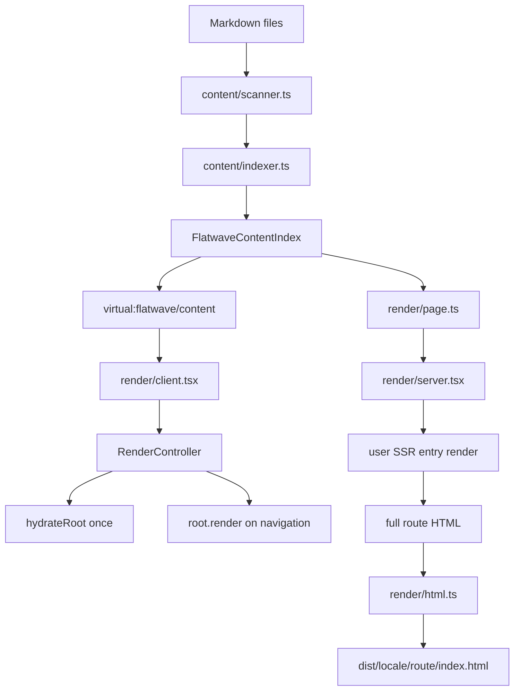
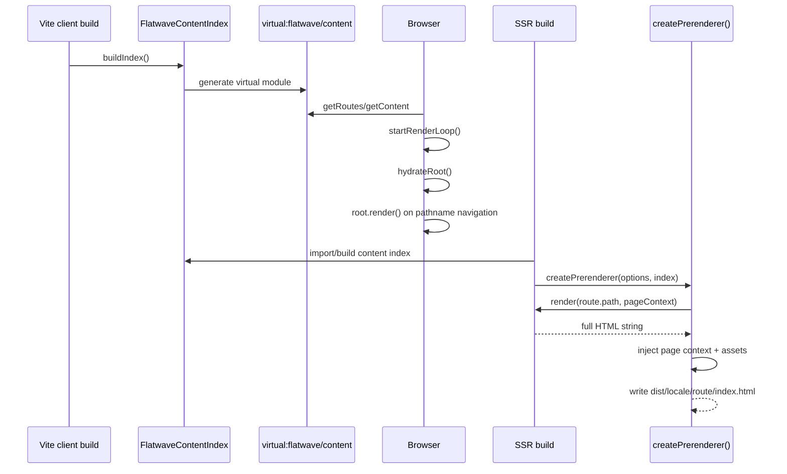

# Architecture: vite-plugin-flatwave-react

## 1. Overview

`vite-plugin-flatwave-react` is a Vite plugin for Markdown-driven, i18n-aware static React sites. The current architecture uses one render pipeline under `packages/vite-plugin-flatwave-react/src/render/` for both build-time SSR/static pre-rendering and browser hydration/navigation.

The primary goal is SEO: every public route must be available as a pathname URL with rendered HTML and SEO metadata in the initial response. Client-side navigation enhances the static site after hydration, but it does not fetch page data on route changes.

Current architecture rules:

- Pathname routing only: `/es/about`, `/pt/program`
- No hash routing
- No client data fetching for navigation
- Unknown client routes are rejected; v1 does not render a client 404
- Manual scroll save/restore only; no View Transitions API in v1
- `src/render/` is the only render pipeline
- `src/prerender/`, `src/render-loop/`, and `src/ssg/` are not part of the current architecture

---

## 2. Source Layout

```text
packages/vite-plugin-flatwave-react/src/
├── cli/                    # flatwave-validate CLI
├── content/                # Markdown scanning, validation, route/index building
├── react/                  # React hooks over virtual:flatwave/content
├── render/                 # single server + browser render pipeline
│   ├── client.tsx          # public render-loop API: startRenderLoop()
│   ├── controller.tsx      # hydration, route rendering, document head updates
│   ├── html.ts             # template loading, asset extraction, shell/context injection
│   ├── index.ts            # render barrel export
│   ├── navigation.ts       # link interception, History API routing, route validation
│   ├── page.ts             # route/content resolution, filtering, serialization
│   ├── scroll-manager.ts   # manual scroll save/restore
│   ├── server-entry.ts     # server-only package export entry
│   ├── server.tsx          # SSR/prerender adapter: createPrerenderer()
│   └── types.ts            # render-loop and serialized page context types
├── seo/                    # SEO/head tag rendering helpers
├── index.ts                # Vite plugin orchestration only
└── virtual.d.ts            # TypeScript declarations for virtual modules/render-loop
```

Removed/merged areas:

| Old area           | Current location                                                                                                 |
| ------------------ | ---------------------------------------------------------------------------------------------------------------- |
| `src/prerender/`   | `src/render/server.tsx`, `src/render/page.ts`, `src/render/html.ts`                                              |
| `src/render-loop/` | `src/render/client.tsx`, `src/render/controller.tsx`, `src/render/navigation.ts`, `src/render/scroll-manager.ts` |
| `src/ssg/`         | SSG behavior lives in `src/index.ts` plus `src/render/html.ts` helpers                                           |

---

## 3. High-Level Architecture



Runtime flow:



---

## 4. Plugin Orchestration

`src/index.ts` exports `flatwaveContent(options)` and returns an array of Vite plugins. It owns plugin orchestration only; render behavior is delegated to `src/render/`.

### 4.1 `flatwave-react:content`

Responsibilities:

- Runs at `buildStart`
- Builds `FlatwaveContentIndex` with `buildIndex()`
- Validates content with `validateContent()`
- Creates `virtual:flatwave/content`
- Reloads the content index on Markdown HMR

Virtual module resolution:

```ts
resolveId(id) {
  if (id === 'virtual:flatwave/content') return '\0virtual:flatwave/content';
}
```

### 4.2 `flatwave-react:markdown`

Handles direct `.md` imports. It parses Markdown with `gray-matter` and exports a JSON object:

```ts
{
  (body, attributes, frontmatter, locale, slug, id, route, file);
}
```

This is separate from the render pipeline. The render pipeline uses the content index, not direct `.md` imports.

### 4.3 `flatwave-react:ssg`

Runs in `generateBundle` and always emits build metadata when enabled:

- `route-manifest.json`
- `sitemap.xml`
- `robots.txt`

When `prerender` is disabled, it also emits static HTML shells for every public route using `renderRouteHtml()` from `src/render/html.ts`. These shells contain SEO metadata and an empty `#root`; they are not pre-rendered.

When `prerender` is enabled, the client build intentionally does not emit route HTML shells because the separate prerender script writes the final HTML after the SSR build.

### 4.4 `flatwave-react:prerender`

This plugin is kept as a Vite hook wrapper around the render pipeline.

Current behavior:

- If `prerender` is `false` or `undefined`, it is a no-op.
- If `prerender` is enabled and `ssrEntry` ends with `.ts` or `.tsx`, built-in prerendering is skipped during the client build.
- The supported workflow for TypeScript SSR entries is a separate SSR build followed by `scripts/prerender.mjs`.
- The non-TypeScript path remains available for legacy/manual use, but the current example uses the separate script.

This avoids trying to load a TypeScript SSR entry before the SSR bundle exists.

---

## 5. Content Pipeline

### 5.1 Scanner

`src/content/scanner.ts` scans locale folders under `contentDir`:

```text
src/content/
├── es/
│   ├── index.md
│   └── about.md
└── pt/
    ├── index.md
    └── about.md
```

Each Markdown file is parsed with `gray-matter` into:

```ts
{
  (file, locale, slug, body, frontmatter);
}
```

Route rules:

- `slug: "index"` or `/` becomes `/{locale}/`
- `slug: "about"` becomes `/{locale}/about`
- Leading/trailing slashes are normalized

### 5.2 Indexer

`src/content/indexer.ts` builds `FlatwaveContentIndex`:

```ts
interface FlatwaveContentIndex {
  entries: FlatwaveContentEntry[];
  byId: Record<string, Record<string, FlatwaveContentEntry>>;
  byLocale: Record<string, Record<string, FlatwaveContentEntry>>;
  routes: FlatwaveRoute[];
}
```

Important details:

- `entries` contains public entries only after route/index construction.
- `byId[id][locale]` groups translations by content id.
- `byLocale[locale][id]` supports locale-specific lookup.
- `routes` contains one route per public content entry.
- `alternatives` are built from matching ids across locales.

### 5.3 Route Builder

`src/content/routeBuilder.ts` converts public entries into routes:

```ts
interface FlatwaveRoute {
  locale: string;
  path: string;
  contentId: string;
  component?: string;
  metadata: SeoMetadata;
  frontmatter: FlatwaveFrontmatter;
  alternatives: Record<string, string>;
}
```

SEO metadata is built from frontmatter:

- `title`
- `description`
- `canonical`
- `image`
- `robots`
- `keywords`
- `jsonLd`
- `og`
- `twitter`

### 5.4 Validator

`src/content/validator.ts` validates:

- Required frontmatter fields
- Duplicate ids within a locale
- Duplicate slugs within a locale
- Duplicate menu/menu_position pairs
- Component existence when `validateComponents` is enabled
- Missing locale variants, with warnings or errors when `strictMissingLocales` is enabled

Default required fields:

```ts
['title', 'slug', 'id', 'component', 'public'];
```

---

## 6. Virtual Module

The generated module `virtual:flatwave/content` is the client-side source of truth for route/content lookup.

Generated API:

```ts
export function getContent(id: string, locale?: string);
export function getAllContent();
export function getRoutes(locale?: string);
export function getAlternatives(contentId: string, currentLocale?: string);
export function getLocale(locale?: string);
export function getLocales();
export function getDefaultLocale();

export const flatwaveContentIndex: FlatwaveContentIndex;
```

The module is generated from the in-memory content index at build start. The client render loop imports `getRoutes()` and `getContent()` from this virtual module.

---

## 7. Single Render Pipeline

All render responsibilities live in `src/render/`.

```text
src/render/
├── types.ts              # render-loop types and serialized page context
├── page.ts               # route/content resolution, filtering, serialization
├── html.ts               # template loading, asset extraction, HTML shell/context injection
├── server.tsx            # SSR/prerender adapter
├── server-entry.ts       # server-only package export entry
├── client.tsx            # public browser API
├── controller.tsx        # hydration, rendering, document head updates
├── navigation.ts         # link interception and History API routing
└── scroll-manager.ts     # manual scroll save/restore
```

### 7.1 Shared Pure Helpers

`page.ts` and `html.ts` are shared by server and browser code where possible.

`page.ts` exports:

- `resolveRouteByPath()`
- `resolveContentForRoute()`
- `buildPageContext()`
- `serializePageContext()`
- `deserializePageContext()`
- `filterRoutesForPrerender()`
- `validateRouteForNavigation()`
- `getRouteInventory()`

`html.ts` exports:

- `loadTemplate()`
- `extractAssets()`
- `injectPageContextScript()`
- `injectPreRenderedHtml()`
- `renderRouteHtml()`
- `renderHtmlShell()`
- `injectIntoTemplate()`

### 7.2 Server Adapter

`src/render/server.tsx` exports the build-time SSR/prerender API.

Main exports:

```ts
createRenderer(ssrEntry, index, componentRegistry);
createPrerenderer(options, index);
```

The SSR entry must export:

```ts
export async function render(url: string, pageContext: PageContext): Promise<string>;
```

`PageContext` shape passed to the SSR entry:

```ts
interface PageContext {
  locale: string;
  content: FlatwaveContentEntry;
  route: FlatwaveRoute;
  components: Record<string, React.ComponentType<any>>;
}
```

`createPrerenderer()` workflow:

1. Normalize prerender options.
2. Load the HTML template from `options.template` or root `index.html`.
3. Discover components from `componentsDir` or defaults.
4. Create the SSR renderer from `ssrEntry`.
5. Filter routes for prerendering.
6. Read `dist/index.html` to extract built client assets.
7. For each route:
   - Resolve content from the index.
   - Build serialized page context.
   - Call the SSR renderer.
   - Inject the serialized page context script.
   - Inject client scripts/styles.
   - Return `{ path: 'locale/route/index.html', html }`.

The prerender script writes the returned HTML files to disk.

### 7.3 Server-Only Export

`src/render/server-entry.ts` is the server-safe package entry used by:

```ts
import { createPrerenderer } from 'vite-plugin-flatwave-react/render/server';
```

It exports server-side APIs from `server.tsx`, `html.ts`, and `page.ts`.

This separation is required because Node.js must not load browser render-loop code that imports `virtual:flatwave/content`.

### 7.4 Browser Adapter

`src/render/client.tsx` exports the public render-loop API:

```ts
startRenderLoop(options);
destroyRenderLoop();
getRenderController();
getCurrentPath();
navigateTo(path);
onNavigate(callback);
getPageContext();
useFlatwaveRoute();
```

`startRenderLoop()` creates a `RenderController`, starts it once, and returns the controller.

```tsx
import { startRenderLoop } from 'vite-plugin-flatwave-react/render-loop';
import { App } from './App';

startRenderLoop({
  root: document.getElementById('root')!,
  App,
});
```

### 7.5 RenderController

`src/render/controller.tsx` owns browser hydration and route rendering.

Startup:

1. Resolve the current path.
2. Resolve `SerializedPageContext` from `virtual:flatwave/content`.
3. Call `hydrateRoot(rootElement, <App pageContext={pageContext} />)`.
4. Start `Navigation`.

Route changes:

1. Validate the target route.
2. Save current scroll position.
3. Resolve the next `SerializedPageContext`.
4. Update document head.
5. Call `root.render(<App pageContext={nextPageContext} />)`.
6. Scroll to top for normal navigation or restore saved position for back/forward.

The controller calls `hydrateRoot` once. Later route changes use `root.render()`.

### 7.6 Navigation

`src/render/navigation.ts` intercepts same-origin `<a>` clicks and uses the History API.

Ignored links:

- External `http://`, `https://`, or `//` links
- Hash-only links
- `mailto:` and `tel:` links
- Links with `target`
- Links with `download`
- Static file links such as `.pdf`, `.zip`, `.doc`, `.docx`

Unknown routes are rejected before `history.pushState()`.

### 7.7 Scroll Manager

`src/render/scroll-manager.ts` implements manual scroll behavior:

- Save scroll position before navigation.
- Scroll to top on normal navigation.
- Restore saved scroll position on `popstate`.

There is no View Transitions API usage in v1.

---

## 8. SEO and Head Management

`src/seo/metadata.ts` renders head tags from `FlatwaveRoute.metadata`.

Supported tags:

- `<title>`
- `<meta name="description">`
- `<meta name="robots">`
- `<link rel="canonical">`
- `<link rel="alternate" hreflang="...">`
- `<meta property="og:*">`
- `<meta name="twitter:*">`
- `<meta property="og:image">`
- `<meta name="twitter:image">`
- `<script type="application/ld+json">`

The browser controller updates the document head on navigation for:

- `document.title`
- description meta
- canonical link
- alternate links
- Open Graph tags
- Twitter tags
- JSON-LD scripts

Robots meta is rendered server-side. The current v1 controller does not update robots meta on client navigation.

---

## 9. Build and Pre-render Flow

### 9.1 Client Build

Command in the example:

```bash
vite build
```

Produces:

```text
dist/
├── index.html
├── route-manifest.json
├── sitemap.xml
├── robots.txt
└── assets/
```

When `prerender` is enabled, the client build intentionally does not write per-route HTML. The final route HTML is produced by the prerender script.

### 9.2 SSR Build

Command in the example:

```bash
vite build --config vite.config.ssr.ts
```

Produces:

```text
dist-ssr/
└── entry-server.js
```

The example SSR config must alias or externalize `virtual:flatwave/content` because Node.js cannot load the Vite virtual module directly. The example uses:

```ts
ssr: {
  external: ['virtual:flatwave/content'],
  noExternal: ['react', 'react-dom', 'react-dom/server'],
},
resolve: {
  alias: {
    'virtual:flatwave/content': path.resolve(__dirname, 'src/virtual-content-ssr.ts'),
  },
},
```

### 9.3 Prerender Script

Command in the example:

```bash
node scripts/prerender.mjs
```

The script is a thin wrapper around public APIs:

```js
import { createPrerenderer } from 'vite-plugin-flatwave-react/render/server';
import { buildIndex } from 'vite-plugin-flatwave-react/content/indexer';

const index = await buildIndex(options);
const prerenderer = await createPrerenderer(options, index);
const results = await prerenderer.prerender(distDir);
```

Final output:

```text
dist/
├── es/
│   ├── index.html
│   ├── about/index.html
│   └── program/index.html
├── pt/
│   ├── index.html
│   ├── about/index.html
│   └── program/index.html
├── route-manifest.json
├── sitemap.xml
├── robots.txt
└── assets/
```

---

## 10. Example App Architecture

```text
examples/basic-react-site/
├── index.html
├── vite.config.ts
├── vite.config.ssr.ts
├── src/
│   ├── App.tsx
│   ├── main.tsx
│   ├── entry-server.tsx
│   ├── virtual-content-ssr.ts
│   ├── components/
│   └── content/
└── scripts/
    └── prerender.mjs
```

### 10.1 Client Entry

`src/main.tsx` starts the render loop:

```tsx
import { startRenderLoop } from 'vite-plugin-flatwave-react/render-loop';
import { App } from './App';
import './styles.css';

startRenderLoop({
  root: document.getElementById('root')!,
  App,
});
```

### 10.2 App Component

`src/App.tsx` receives `pageContext` as a prop and renders from it:

```tsx
export function App({
  pageContext,
}: {
  pageContext: { locale: string; content: any; route: any };
}) {
  const { content } = pageContext;
  const Component = content.component === 'ProgramPage' ? ProgramPage : SimplePage;

  return (
    <main>
      <LanguageSwitcher currentLocale={content.locale} contentId={content.id} />
      <Component content={content} />
      <MarkdownRenderer>{content.body}</MarkdownRenderer>
    </main>
  );
}
```

The app does not read `window.location.pathname` to choose content. The render controller resolves the route and passes the resolved context.

### 10.3 SSR Entry

`src/entry-server.tsx` exports `render(url, pageContext)`. It is responsible for:

- Selecting a React component from `content.component`
- Rendering Markdown to HTML
- Returning a full HTML document string

The example uses `react-dom/server` and `markdown-it`. The plugin does not mandate a Markdown renderer; the app/SSR entry owns that choice.

---

## 11. Public Package Exports

Current package exports:

| Export                                       | Points to                     | Purpose                      |
| -------------------------------------------- | ----------------------------- | ---------------------------- |
| `vite-plugin-flatwave-react`                 | `dist/index.js`               | Plugin factory               |
| `vite-plugin-flatwave-react/react`           | `dist/react/index.js`         | React hooks                  |
| `vite-plugin-flatwave-react/seo`             | `dist/seo/metadata.js`        | SEO helper                   |
| `vite-plugin-flatwave-react/validation`      | `dist/content/validator.js`   | Validation API               |
| `vite-plugin-flatwave-react/types`           | `dist/types.d.ts`             | Type declarations            |
| `vite-plugin-flatwave-react/render-loop`     | `dist/render/client.js`       | Browser render-loop API      |
| `vite-plugin-flatwave-react/render`          | `dist/render/index.js`        | Full render barrel export    |
| `vite-plugin-flatwave-react/render/server`   | `dist/render/server-entry.js` | Server-safe prerender API    |
| `vite-plugin-flatwave-react/content/indexer` | `dist/content/indexer.js`     | Public content index builder |

---

## 12. Data Models

### 12.1 `FlatwaveContentEntry`

```ts
interface FlatwaveContentEntry {
  id: string;
  locale: string;
  slug: string;
  path: string;
  file: string;
  component?: string;
  public: boolean;
  attributes: FlatwaveFrontmatter;
  frontmatter: FlatwaveFrontmatter;
  body: string;
  route: string;
  alternatives: Record<string, string>;
}
```

### 12.2 `FlatwaveRoute`

```ts
interface FlatwaveRoute {
  locale: string;
  path: string;
  contentId: string;
  component?: string;
  metadata: SeoMetadata;
  frontmatter: FlatwaveFrontmatter;
  alternatives: Record<string, string>;
}
```

### 12.3 `SerializedPageContext`

```ts
interface SerializedPageContext {
  locale: string;
  route: FlatwaveRoute;
  content: FlatwaveContentEntry;
}
```

This context is serialized into pre-rendered HTML and is also the prop shape passed to the browser `App` component by the render controller.

### 12.4 `RenderLoopOptions`

```ts
interface RenderLoopOptions {
  enabled?: boolean;
  basePath?: string;
  scrollToTop?: boolean;
}
```

In v1, the app still starts the render loop explicitly with `startRenderLoop()`. The option exists in the plugin configuration types but is not used to automatically inject client bootstrap code.

---

## 13. v1 Constraints and Known Behavior

### Implemented constraints

- Pathname routing only
- No hash routing
- No client data fetching for navigation
- Unknown routes are rejected
- `hydrateRoot` is called once
- Route changes call `root.render()`
- Manual scroll save/restore only
- No View Transitions API
- SSR entry must export `render(url, pageContext)`
- TypeScript SSR entries require a separate SSR build before prerendering

### v1 limitations

- `PrerenderOptions.stream` is typed but not implemented in the current prerenderer.
- `renderLoop` is typed in plugin options but does not automatically bootstrap the browser app.
- The client controller resolves route/content from `virtual:flatwave/content`; it does not parse the serialized `flatwave-page-context` script on initial load.
- The browser controller does not update robots meta on client navigation.
- There is no client 404 page in v1.

---

## 14. Validation and Testing

Validation commands:

```bash
npm run build:plugin
npm run build:example
npm run prerender -w @flatwave/example-basic-react-site
npm test -w vite-plugin-flatwave-react
```

Example validation CLI:

```bash
node packages/vite-plugin-flatwave-react/dist/cli/validate.js \
  --content-dir examples/basic-react-site/src/content \
  --locales es,pt \
  --default-locale es \
  --components-dir examples/basic-react-site/src/components
```

Test coverage currently includes:

- Plugin factory and sub-plugin composition
- Content indexing and route manifest generation
- Sitemap and robots generation
- HTML shell generation when prerender is disabled
- Prerenderer API availability
- Output HTML checks after example prerendering

Future tests should cover:

- `resolveContentForRoute()`
- `filterRoutesForPrerender()`
- `injectPageContextScript()`
- `extractAssets()`
- `Navigation` link interception
- `ScrollManager`
- Unknown route rejection
- Browser render-loop hydration behavior

---

## 15. Deployment

The final `dist/` directory after client build, SSR build, and prerender script is a static site.

Compatible hosts:

- Netlify
- Vercel
- Cloudflare Pages
- GitHub Pages
- AWS S3 + CloudFront
- nginx
- Apache

Static hosting must preserve locale-prefixed pathname routes:

```text
/es/
/es/about
/es/program
/pt/
/pt/about
/pt/program
```

---

## 16. Migration from HTML-Shell-Only SSG

| Previous behavior                           | Current behavior                                                 |
| ------------------------------------------- | ---------------------------------------------------------------- |
| `src/prerender/` owned build-time rendering | `src/render/server.tsx` owns build-time rendering                |
| `src/render-loop/` owned browser rendering  | `src/render/client.tsx` + `controller.tsx` own browser rendering |
| `src/ssg/` existed as a separate area       | SSG behavior is in `src/index.ts` plus `src/render/html.ts`      |
| Client app read `window.location.pathname`  | Render controller resolves route and passes `pageContext`        |
| Empty root in generated HTML                | Full SSR HTML after prerender script                             |
| Client data could be route-derived          | Client navigation resolves from virtual module, no fetch         |

---

## 17. Version History

| Version | Date       | Changes                                                                                                                                                                           |
| ------- | ---------- | --------------------------------------------------------------------------------------------------------------------------------------------------------------------------------- |
| 0.1.0   | 2026-06-16 | Initial render-loop architecture: single `src/render/` pipeline, `createPrerenderer()`, `startRenderLoop()`, pathname routing, manual scroll restoration, SEO-first static output |

---

## 18. License

MIT © 2026 – Flatwave contributors.
