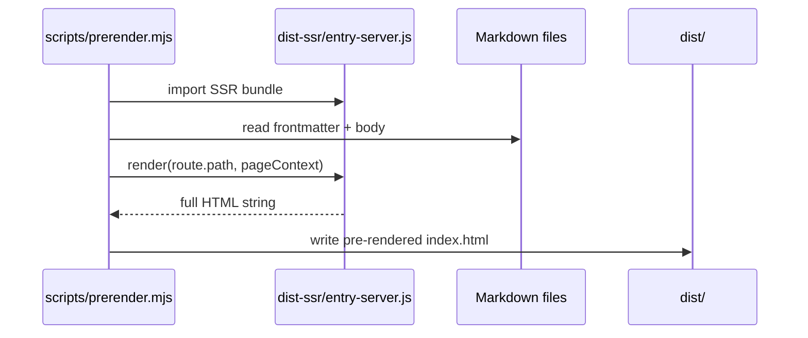

# Architecture: vite-plugin-flatwave-react

## Overview

This document describes the **actual implemented architecture** of `vite-plugin-flatwave-react`, a Vite plugin for Markdown-driven, i18n-aware static React sites with build-time pre-rendering (SSG) support.

The plugin transforms Markdown files with frontmatter into a typed content index, exposes virtual modules for client-side access, generates SEO-optimized static HTML with full React pre-rendering, and provides a validation CLI.

---

## 1. High-Level Architecture

```mermaid
flowchart TD
    A[Vite Build] --> B[flatwave-react:content]
    B --> C[Content Index]
    C --> D[flatwave-react:markdown]
    C --> E[flatwave-react:ssg]
    C --> F[flatwave-react:prerender]
    
    E --> G[route-manifest.json]
    E --> H[sitemap.xml]
    E --> I[robots.txt]
    E --> J[HTML Shells]
    
    F --> K[SSR Entry (entry-server.tsx)]
    K --> L[ReactDOMServer.renderToString]
    L --> M[Pre-rendered HTML]
    
    M --> N[dist/{locale}/{route}/index.html]
```

### Plugin Pipeline (execution order)

| Order | Plugin | Role |
|-------|--------|------|
| 1 | `flatwave-react:content` | Scans, parses, validates Markdown; builds content index & route manifest |
| 2 | `flatwave-react:markdown` | Handles direct `.md` imports (`import content from './about.md'`) |
| 3 | `flatwave-react:ssg` | Emits static assets: route-manifest, sitemap, robots.txt, HTML shells |
| 4 | `flatwave-react:prerender` | (noop during build) Provides `createPrerenderer()` for external SSG step |

---

## 2. Core Modules

### 2.1 `src/index.ts` — Plugin Factory

Main entry point exporting `flatwaveContent(options)`.

**Key responsibilities:**
- Normalizes options with defaults
- Builds content index at `buildStart`
- Creates virtual module (`virtual:flatwave/content`)
- Handles HMR for `.md` file changes
- Composes 4 sub-plugins: content, markdown, ssg, prerender

**Returns:** `Promise<Plugin[]>` (async to support prerenderer creation)

---

### 2.2 Content Pipeline (`src/content/`)

| File | Responsibility |
|------|----------------|
| `scanner.ts` | Recursively finds `.md` files in `contentDir/{locale}/`; parses with `gray-matter` |
| `parser.ts` | Exports `parseMarkdown()` for standalone `.md` import handling |
| `validator.ts` | Validates required fields, duplicate IDs/slugs, component existence, missing locales |
| `routeBuilder.ts` | Builds route inventory with SEO metadata, alternates, fallbacks |
| `indexer.ts` | Orchestrates scanner → validator → routeBuilder |

**Data flow:**
```
Markdown files → scanner → ParsedMarkdownFile[] → routeBuilder → FlatwaveContentIndex
```

---

### 2.3 Virtual Module (`virtual:flatwave/content`)

Generated at `buildStart`, provides:

```typescript
export function getContent(id: string, locale?: string): FlatwaveContentEntry | undefined
export function getAllContent(): FlatwaveContentEntry[]
export function getRoutes(locale?: string): FlatwaveRoute[]
export function getAlternatives(contentId: string, currentLocale?: string): Record<string, string>
export function getLocale(locale?: string): string | undefined
export function getLocales(): string[]
export function getDefaultLocale(): string
export const flatwaveContentIndex: FlatwaveContentIndex
```

---

### 2.4 SEO Metadata (`src/seo/metadata.ts`)

Generates all SEO tags:
- `<title>`, `<meta name="description">`
- `<link rel="canonical">`
- `<link rel="alternate" hreflang="...">` for all locales
- Open Graph (`og:title`, `og:description`, `og:image`, etc.)
- Twitter Card (`twitter:card`, `twitter:title`, `twitter:image`, etc.)
- JSON-LD (`<script type="application/ld+json">`)
- `<meta name="robots">`

---

### 2.5 Prerender Module (`src/prerender/`) — **NEW in v0.1**

| File | Responsibility |
|------|----------------|
| `index.ts` | `createPrerenderPlugin()` (noop during build) + `createPrerenderer()` for external SSG |
| `renderer.ts` | Loads SSR entry via dynamic import; wraps `render()` with context enrichment |
| `template.ts` | Loads `index.html` as template; injects assets + pre-rendered HTML |

**Key design:** Prerendering happens in a **separate script** after both client + SSR builds complete, due to Vite's build order constraints.

---

### 2.6 Templates

| File | Purpose |
|------|---------|
| `templates/entry-server.tsx` | Default SSR entry with component registry, `render()` export |

---

## 3. Data Models

### 3.1 `FlatwaveContentEntry`

```typescript
interface FlatwaveContentEntry {
  id: string;                    // from frontmatter.id or slug
  locale: string;                // e.g., 'es', 'pt'
  slug: string;                  // URL segment
  path: string;                  // full route: /es/about
  file: string;                  // absolute file path
  component?: string;            // React component name
  public: boolean;               // false = excluded from routes
  attributes: Record<string, unknown>;  // raw frontmatter
  frontmatter: Record<string, unknown>; // normalized frontmatter
  body: string;                  // raw Markdown body
  route: string;                 // same as path
  alternatives: Record<string, string>; // { pt: '/pt/about', ... }
}
```

### 3.2 `FlatwaveRoute`

```typescript
interface FlatwaveRoute {
  locale: string;
  path: string;                  // /es/about
  contentId: string;             // references entry.id
  component?: string;            // component name
  metadata: SeoMetadata;         // title, description, canonical, image, etc.
  frontmatter: FlatwaveFrontmatter;
  alternatives: Record<string, string>; // hreflang map
}
```

### 3.3 `SeoMetadata`

```typescript
interface SeoMetadata {
  title: string;
  description?: string;
  canonical?: string;
  image?: string;
  robots?: string;
  keywords?: string[];
  jsonLd?: unknown;
  og?: Record<string, string>;
  twitter?: Record<string, string>;
}
```

### 3.4 `PrerenderOptions`

```typescript
interface PrerenderOptions {
  routes?: string[] | ((routes: FlatwaveRoute[]) => string[]);
  exclude?: string[];
  stream?: boolean;
  template?: string;
}
```

---

## 4. Build Process

### 4.1 Client Build (`vite build`)

```
┌─────────────────────────────────────┐
│ 1. flatwave-react:content           │
│    - buildIndex() → content index   │
│    - validateContent()              │
│    - create virtual module          │
├─────────────────────────────────────┤
│ 2. flatwave-react:markdown          │
│    - .md imports → structured obj   │
├─────────────────────────────────────┤
│ 3. flatwave-react:ssg               │
│    - emit route-manifest.json       │
│    - emit sitemap.xml               │
│    - emit robots.txt                │
│    - emit HTML shells (empty #root) │
└─────────────────────────────────────┘
```

### 4.2 SSR Build (`vite build --ssr src/entry-server.tsx`)

Produces `dist-ssr/entry-server.js` — the SSR bundle containing:
- `render(url, pageContext)` function
- Component registry (SimplePage, ProgramPage, etc.)
- Markdown rendering logic (markdown-it)

### 4.3 Pre-render Step (`npm run prerender`)



---

## 5. Example App Structure

```
examples/basic-react-site/
├── src/
│   ├── content/
│   │   ├── es/{index,about,program}.md
│   │   │   └── pt/{index,about,program}.md
   ├── components/
   │   ├── SimplePage.tsx
   │   ├── ProgramPage.tsx
   │   ├── LanguageSwitcher.tsx
   │   └── MarkdownRenderer.tsx
   ├── entry-server.tsx          # SSR entry
   ├── App.tsx                   # client-side routing
   └── main.tsx
├── scripts/
│   └── prerender.mjs             # runs pre-render
├── vite.config.ts
└── package.json
```

---

## 6. SSG Pre-rendering Design

### 6.1 Two-Step Architecture

| Step | Command | Output |
|------|---------|--------|
| 1 | `vite build` | Client bundle + static assets + HTML shells |
| 2 | `vite build --ssr` | SSR bundle (`dist-ssr/entry-server.js`) |
| 3 | `node scripts/prerender.mjs` | Fully rendered HTML in `dist/` |

### 6.2 Why Separate Script?

Vite executes `generateBundle` **after** client build but **before** SSR build. The prerenderer needs the SSR bundle, so it must run after both builds complete. A separate script keeps the plugin simple and Vite-native.

### 6.3 Pre-rendered HTML Features

- ✅ Full React component tree (no empty `<div id="root">`)
- ✅ Markdown → HTML via `markdown-it` (SSR-safe)
- ✅ All SEO metadata (title, description, canonical, hreflang, OG, Twitter, JSON-LD)
- ✅ Client hydration via `hydrateRoot`
- ✅ Asset injection (scripts, styles) from client build
- ✅ Per-locale output: `dist/{locale}/{route}/index.html`

---

## 6.4 Configuration API

```typescript
flatwaveContent({
  contentDir: 'src/content',
  locales: ['es', 'pt'],
  defaultLocale: 'es',
  
  // SSG options
  prerender: true,                    // enable all routes
  // or
  prerender: {
    routes: ['/es/', '/es/about'],   // explicit allowlist
    exclude: ['/admin/*'],           // glob exclude patterns
    stream: false,                   // use renderToString (default)
  },
  ssrEntry: 'src/entry-server.tsx', // custom SSR entry
});
```

---

## 7. Testing Strategy

### 7.1 Test Structure

```
tests/
├── unit/
│   ├── index.test.ts                 # plugin factory
│   └── prerender/
│       ├── renderer.test.ts          # route filtering, options
│       └── template.test.ts          # template loading, injection
├── integration/
│   └── plugin.test.ts                # full Vite build + output validation
├── e2e/
│   └── full-pipeline.test.ts         # build + prerender + output checks
└── fixtures/
    └── basic-site/                   # test content + components
```

### 7.2 Coverage Targets

| Layer | Target |
|-------|--------|
| Core plugin (`src/index.ts`) | >70% |
| Content pipeline | >75% |
| Prerender module | >50% |
| SEO metadata | >60% |

---

## 8. Deployment

### 8.1 Static Hosting

The `dist/` output is a complete static site:

```
dist/
├── es/
│   ├── index.html
│   ├── about/index.html
│   └── program/index.html
├── pt/
│   ├── index.html
│   ├── about/index.html
│   └── program/index.html
├── route-manifest.json
├── sitemap.xml
├── robots.txt
└── assets/
    ├── index-*.js
    └── index-*.css
```

Compatible with: Netlify, Vercel, Cloudflare Pages, GitHub Pages, AWS S3 + CloudFront, nginx, Apache.

### 8.2 Docker

```bash
# Build static site
docker compose -f docker/docker-compose.yml up build

# Serve with nginx
docker compose -f docker/docker-compose.yml up static
```

---

## 9. Validation CLI

```bash
flatwave-validate \
  --content-dir src/content \
  --locales es,pt \
  --default-locale es \
  --components-dir src/components \
  --strict-missing
```

Reuses the same validator as the Vite plugin. Exit code 1 on errors.

---

## 10. TypeScript Support

- Full type definitions in `dist/` via `tsc`
- Virtual module types in `src/virtual.d.ts`
- Content index types exported from `types.ts`
- React hooks typed via `react/index.ts`

---

## 11. Security Considerations

- No runtime secrets in generated output
- `.kilo/kilo.json` (local MCP config) is gitignored
- Personal access tokens must use environment variables
- Markdown body sanitized via `markdown-it` (no XSS)

---

## 12. Extending the Plugin

### Add a new SSG adapter

1. Read `route-manifest.json`
2. For each route, load content + component
3. Render to static HTML
4. Write to `dist/{locale}/{route}/index.html`

### Custom component registry

```tsx
// entry-server.tsx
export function registerComponent(name, component) { ... }
// Called by prerenderer with discovered components
```

---

## 13. Migration from v0.0 (HTML shells only)

| Before (v0.0) | After (v0.1 + prerender) |
|---------------|--------------------------|
| Empty `<div id="root">` in HTML | Fully rendered React tree |
| Client-only rendering | Pre-rendered + hydrated |
| SEO meta only | Full SEO + content in HTML |
| `npm run build` | `npm run build && npm run prerender` |

---

## 14. Version History

| Version | Date | Changes |
|---------|------|---------|
| 0.1.0 | 2026-06-16 | Initial release: content indexing, i18n, SEO, SSG pre-rendering, validation CLI, test suite |

---

## 15. License

MIT © 2026 – Flatwave contributors.