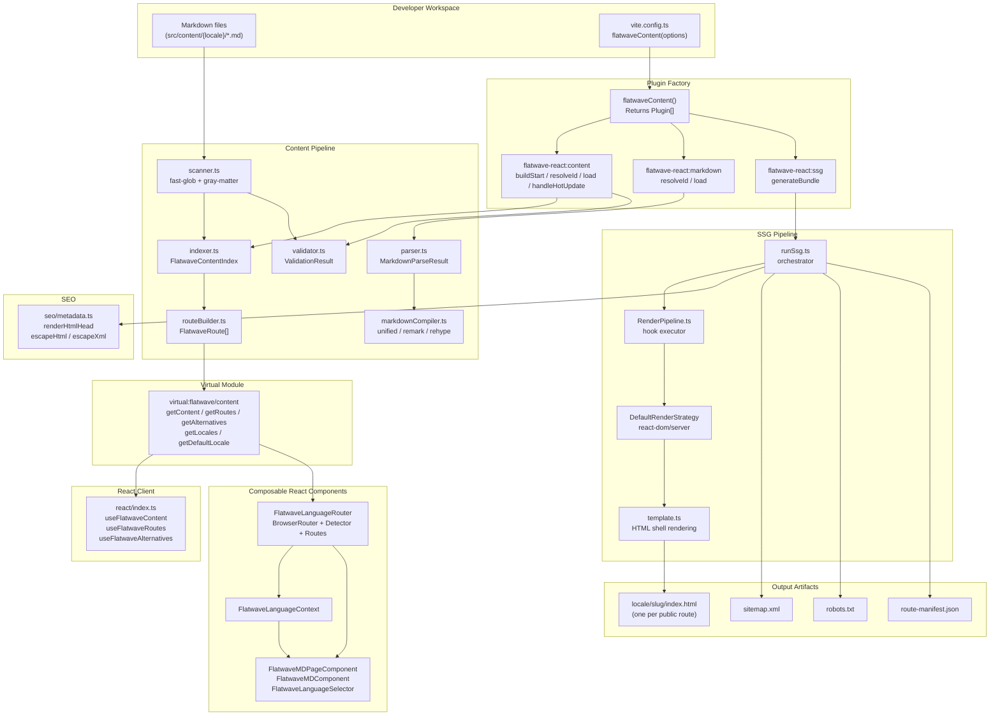
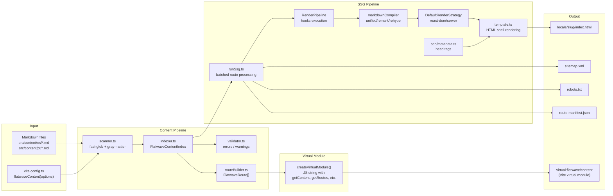
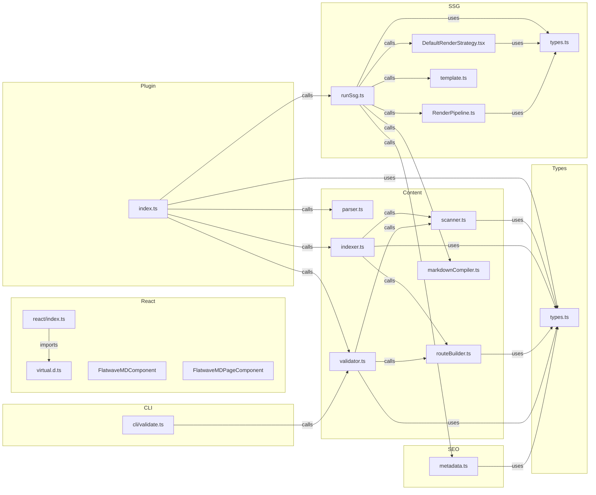

# Architecture — `@kamansoft/vite-plugin-flatwave-react`

> Detailed system design, component relationships, data flows, and processing workflows for the Flatwave React Vite plugin.

---

## Table of Contents

1. [Overview](#overview)
2. [Repository Structure](#repository-structure)
3. [System Architecture](#system-architecture)
4. [Module Breakdown](#module-breakdown)
   - [Plugin Core (`index.ts`)](#plugin-core-indexts)
   - [Content Pipeline](#content-pipeline)
   - [SSG Pipeline](#ssg-pipeline)
   - [Composable React Components](#composable-react-components)
   - [SEO Module](#seo-module)
   - [CLI Tool](#cli-tool)
5. [Data Flow Diagrams](#data-flow-diagrams)
   - [Build-time Data Flow](#build-time-data-flow)
   - [Virtual Module Flow](#virtual-module-flow)
   - [SSG Rendering Pipeline](#ssg-rendering-pipeline)
6. [Sequence Diagrams](#sequence-diagrams)
   - [Plugin Initialization Sequence](#plugin-initialization-sequence)
   - [Content Indexing Sequence](#content-indexing-sequence)
   - [SSG Page Rendering Sequence](#ssg-page-rendering-sequence)
   - [CLI Validation Sequence](#cli-validation-sequence)
7. [Type System](#type-system)
8. [Interrelationship Map](#interrelationship-map)
9. [Glossary](#glossary)

---

## Overview

`@kamansoft/vite-plugin-flatwave-react` is a **Vite plugin** that transforms a directory of Markdown files (with YAML front-matter) into a fully type-safe, i18n-aware, statically-generated React site. It operates entirely at **build time**, producing locale-prefixed HTML pages, `sitemap.xml`, `robots.txt`, and `route-manifest.json` as output artifacts.

The plugin also provides **composable React components** that consumers can use to build their applications:

- `FlatwaveMDComponent` - Markdown content renderer (SSG or client-side mode)
- `FlatwaveMDPageComponent` - Full-page wrapper with SEO head tags
- `FlatwaveLanguageRouter` - Complete router with language detection
- `FlatwaveLanguageDetector` - Language detection and redirect logic
- `FlatwaveAppRoutes` - Dynamic route rendering
- `FlatwaveLanguageSelector` - Language switcher UI
- `FlatwaveLanguageContext` - React context for locale state

The plugin is composed of three cooperating Vite plugin instances returned as an array from the single `flatwaveContent()` factory function:

| Plugin name               | Role                                                                        |
| ------------------------- | --------------------------------------------------------------------------- |
| `flatwave-react:content`  | Scans markdown, builds the content index, validates, exposes virtual module |
| `flatwave-react:markdown` | Transforms individual `.md` files into importable ES modules                |
| `flatwave-react:ssg`      | Renders all routes to static HTML after the Vite bundle is generated        |

---

## Repository Structure

```
vite-plugin-flatwave-react/          ← npm workspace root
├── packages/
│   └── vite-plugin-flatwave-react/  ← publishable npm package
│       ├── src/
│       │   ├── index.ts             ← plugin factory + virtual module factory
│       │   ├── types.ts             ← all shared TypeScript interfaces/types
│       │   ├── virtual.d.ts         ← TypeScript declarations for virtual:flatwave/content
│       │   ├── content/
│       │   │   ├── scanner.ts       ← file discovery (fast-glob) + gray-matter parsing
│       │   │   ├── parser.ts        ← standalone markdown parse (gray-matter wrapper)
│       │   │   ├── indexer.ts       ← builds FlatwaveContentIndex from scanned files
│       │   │   ├── routeBuilder.ts  ← assembles FlatwaveRoute[] with SEO metadata
│       │   │   ├── validator.ts     ← content rules: required fields, duplicates
│       │   │   └── markdownCompiler.ts ← unified/remark/rehype markdown → HTML
│       │   ├── ssg/
│       │   │   ├── runSsg.ts        ← orchestrates SSG: renders all routes in batches
│       │   │   ├── RenderPipeline.ts ← hook executor (5 phases + emitFiles)
│       │   │   ├── DefaultRenderStrategy.tsx ← React renderToString strategy
│       │   │   ├── template.ts      ← EJS-style template resolver + renderer
│       │   │   ├── types.ts         ← RenderContext, TemplateVariables, EmitFilesContext
│       │   │   ├── index.ts         ← public re-exports of ./ssg
│       │   │   └── templates/
│       │   │       ├── index.html.ejs      ← default HTML shell template
│       │   │       ├── entry-client.tsx.ejs
│       │   │       └── entry-server.tsx.ejs
│       │   ├── react/
│       │   │   ├── index.ts         ← React hooks + component exports
│       │   │   ├── types.ts         ← FlatwaveMDComponentProps, FlatwaveMDPageProps, etc.
│       │   │   ├── FlatwaveMDComponent.tsx ← Markdown content component
│       │   │   ├── FlatwaveMDPageComponent.tsx ← Page wrapper with SEO heads
│       │   │   ├── FlatwaveLanguageContext.ts ← React context for locale
│       │   │   ├── FlatwaveLanguageDetector.tsx ← URL/browser language detection
│       │   │   ├── FlatwaveLanguageRouter.tsx ← Composed router component
│       │   │   ├── FlatwaveAppRoutes.tsx ← Dynamic route mapping
│       │   │   └── FlatwaveLanguageSelector.tsx ← Language switcher UI
│       │   ├── seo/metadata.ts      ← HTML head tag generators, escape helpers
│       │   └── cli/
│       │       └── validate.ts      ← CLI entry: `flatwave-validate` command
│       ├── tsconfig.build.json
│       └── package.json             ← exports map, bin, peer deps
├── examples/
│   └── basic-react-site/            ← example consumer app (Vite + React)
├── e2e/
│   └── example.test.ts             ← Vitest integration suite (builds + serves + asserts)
└── docs/                            ← project documentation
```

---

## System Architecture



---

## Module Breakdown

### Plugin Core (`index.ts`)

The entry point exports the `flatwaveContent(options)` factory which:

1. **Normalizes options** — fills in defaults for optional fields (`requiredFields`, `emitRouteManifest`, `emitSitemap`, `emitRobotsTxt`, `ssg`).
2. **Returns three plugin objects** that Vite integrates into its build pipeline.

```
flatwaveContent(options)
    │
    ├─► normalizeOptions(options)   fills in all optional defaults
    │
    ├─► Plugin 1: flatwave-react:content
    │       buildStart()    → buildIndex() + validateContent()
    │       resolveId()     → maps "virtual:flatwave/content" → "\0virtual:..."
    │       load()          → createVirtualModule(index, defaultLocale)
    │       handleHotUpdate() → re-runs buildIndex() on .md changes
    │
    ├─► Plugin 2: flatwave-react:markdown
    │       resolveId()     → resolves .md file paths
    │       load()          → parseMarkdown() + inferLocale() → ES module
    │
    └─► Plugin 3: flatwave-react:ssg
            generateBundle() → runSsg(index, options, assets) → emitFile()
```

**Note**: `componentsDir` and component validation have been removed. Route rendering now uses `FlatwaveMDPageComponent` as the single default renderer.

---

### Content Pipeline

```
src/content/
├── scanner.ts       ← Discovers and parses all .md files
├── parser.ts        ← Parses a single markdown string
├── indexer.ts       ← Builds the FlatwaveContentIndex
├── routeBuilder.ts  ← Assembles routes and SEO metadata
├── validator.ts     ← Runs all validation rules
└── markdownCompiler.ts ← Converts Markdown body → HTML
```

---

### SSG Pipeline

```
src/ssg/
├── runSsg.ts              ← main orchestrator
├── RenderPipeline.ts      ← hook phase executor (5 phases + emitFiles)
├── DefaultRenderStrategy.tsx ← react-dom/server renderer
├── template.ts            ← HTML template resolution + rendering
├── types.ts               ← RenderContext, TemplateVariables, EmitFilesContext
├── index.ts               ← public re-exports of ./ssg
└── templates/
    ├── index.html.ejs      ← default HTML shell
    ├── entry-client.tsx.ejs
    └── entry-server.tsx.ejs
```

---

### Composable React Components

The `src/react/` directory provides reusable React components for building multilingual sites:

```
src/react/
├── index.ts           ← Exports all hooks and components
├── types.ts           ← Props interfaces (FlatwaveMDComponentProps, etc.)
├── FlatwaveMDComponent.tsx ← Markdown renderer (SSG or client-side)
├── FlatwaveMDPageComponent.tsx ← Page wrapper with Helmet SEO heads
├── FlatwaveLanguageContext.ts ← React context (locale, supportedLanguages)
├── FlatwaveLanguageDetector.tsx ← URL prefix + browser language detection
├── FlatwaveLanguageRouter.tsx ← Composed BrowserRouter + Detector + AppRoutes
├── FlatwaveAppRoutes.tsx ← Dynamic route rendering with render prop
└── FlatwaveLanguageSelector.tsx ← Language switcher UI
```

**Component Patterns:**

- **SSG Mode**: When `markdownHtml` prop is provided, renders pre-compiled HTML
- **Client-side Mode**: When `markdown` prop is provided, uses `react-markdown`
- **Composition**: All components accept render props or wrapper components for customization
- **Default Renderer**: SSG uses `FlatwaveMDPageComponent` as the only renderer. No `componentsDir` or component field is required.

---

### SEO Module

```
src/seo/metadata.ts
```

Generates head tags for title, description, canonical, open graph, hreflang alternates, and JSON-LD structured data.

---

### CLI Tool

```
src/cli/validate.ts
```

Validates content structure before build. Prevents deployment of invalid content.

---

## Data Flow Diagrams

### Build-time Data Flow



---

## Type System

The entire type system is centralized in `packages/vite-plugin-flatwave-react/src/types.ts`. Key interfaces include:

- `FlatwaveContentOptions` - Plugin configuration
- `FlatwaveContentEntry` - Single content item
- `FlatwaveRoute` - URL route with SEO metadata
- `FlatwaveContentIndex` - Content collection index
- `SsgOptions` - SSG configuration with hooks
- `RenderHooks` - Hook phase definitions
- `FlatwaveFrontmatter` - Frontmatter schema

Component props are defined in `src/react/types.ts`:

- `FlatwaveMDComponentProps<TFrontmatter>` - Content component props
- `FlatwaveMDPageProps<TFrontmatter>` - Page component props
- `FlatwaveLanguageRouterProps` - Router configuration
- `FlatwaveAppRoutesProps` - Routes render props

---

## Interrelationship Map



---

## Glossary

| Term                             | Definition                                                                                                                       |
| -------------------------------- | -------------------------------------------------------------------------------------------------------------------------------- |
| **Virtual Module**               | A Vite concept where a module ID resolves to in-memory generated JavaScript. The null-byte prefix `\0` marks virtual module IDs. |
| **Front-matter**                 | YAML metadata block at the top of a Markdown file, delimited by `---`. Parsed by `gray-matter`.                                  |
| **Content Index**                | The central in-memory data structure holding all parsed content entries, lookup maps, and routes.                                |
| **Content Entry**                | A single localized content item representing one `.md` file.                                                                     |
| **Route**                        | A URL path derived from a content entry's locale and slug.                                                                       |
| **Locale**                       | A language/region identifier (e.g. `es`, `pt`).                                                                                  |
| **SSG (Static Site Generation)** | Pre-rendering React components to HTML strings at build time.                                                                    |
| **Render Pipeline**              | An ordered sequence of hook functions around the page rendering process.                                                         |
| **Render Strategy**              | An object implementing `RenderStrategy` (`render(context): Promise<string>`).                                                    |
| **Hook Phase**                   | Lifecycle points: `beforeRender`, `transformMarkdown`, `transformHtml`, `afterRender`, `onError`, `emitFiles`.                   |
