# Architecture — `@kamansoft/vite-plugin-flatwave-react`

> Detailed system design, component relationships, data flows, and processing workflows for the Flatwave React Vite plugin.

---

## Table of Contents

1. [Overview](#overview)
2. [Repository Structure](#repository-structure)
3. [System Architecture](#system-architecture)
4. [Module Breakdown](#module-breakdown)
   - [Plugin Core (`index.ts`)](#plugin-core-indexts)
   - [Content Pipeline](#content-pipeline)
   - [SSG Pipeline](#ssg-pipeline)
   - [React Client Layer](#react-client-layer)
   - [SEO Module](#seo-module)
   - [CLI Tool](#cli-tool)
5. [Data Flow Diagrams](#data-flow-diagrams)
   - [Build-time Data Flow](#build-time-data-flow)
   - [Virtual Module Flow](#virtual-module-flow)
   - [SSG Rendering Pipeline](#ssg-rendering-pipeline)
6. [Sequence Diagrams](#sequence-diagrams)
   - [Plugin Initialization Sequence](#plugin-initialization-sequence)
   - [Content Indexing Sequence](#content-indexing-sequence)
   - [SSG Page Rendering Sequence](#ssg-page-rendering-sequence)
   - [Hot Module Replacement Sequence](#hot-module-replacement-sequence)
   - [CLI Validation Sequence](#cli-validation-sequence)
7. [Type System](#type-system)
8. [Interrelationship Map](#interrelationship-map)
9. [Glossary](#glossary)

---

## Overview

`@kamansoft/vite-plugin-flatwave-react` is a **Vite plugin** that transforms a directory of Markdown files (with YAML front-matter) into a fully type-safe, i18n-aware, statically-generated React site. It operates entirely at **build time**, producing locale-prefixed HTML pages, `sitemap.xml`, `robots.txt`, and `route-manifest.json` as output artifacts.

The plugin is composed of three cooperating Vite plugin instances returned as an array from the single `flatwaveContent()` factory function:

| Plugin name               | Role                                                                        |
| ------------------------- | --------------------------------------------------------------------------- |
| `flatwave-react:content`  | Scans markdown, builds the content index, validates, exposes virtual module |
| `flatwave-react:markdown` | Transforms individual `.md` files into importable ES modules                |
| `flatwave-react:ssg`      | Renders all routes to static HTML after the Vite bundle is generated        |

---

## Repository Structure

```
vite-plugin-flatwave-react/          ← npm workspace root
├── packages/
│   └── vite-plugin-flatwave-react/  ← publishable npm package
│       ├── src/
│       │   ├── index.ts             ← plugin factory + virtual module factory
│       │   ├── types.ts             ← all shared TypeScript interfaces/types
│       │   ├── virtual.d.ts         ← TypeScript declarations for virtual:flatwave/content
│       │   ├── content/
│       │   │   ├── scanner.ts       ← file discovery (fast-glob) + gray-matter parsing
│       │   │   ├── parser.ts        ← standalone markdown parse (gray-matter wrapper)
│       │   │   ├── indexer.ts       ← builds FlatwaveContentIndex from scanned files
│       │   │   ├── routeBuilder.ts  ← assembles FlatwaveRoute[] with SEO metadata
│       │   │   ├── validator.ts     ← content rules: required fields, duplicates, components
│       │   │   └── markdownCompiler.ts ← unified/remark/rehype markdown → HTML
│       │   ├── ssg/
│       │   │   ├── runSsg.ts        ← orchestrates SSG: renders all routes in batches
│       │   │   ├── RenderPipeline.ts ← hook executor (5 phases)
│       │   │   ├── DefaultRenderStrategy.tsx ← React renderToString strategy
│       │   │   ├── template.ts      ← EJS-style template resolver + renderer
│       │   │   ├── types.ts         ← SSG-specific types (RenderContext, etc.)
│       │   │   ├── index.ts         ← public re-exports of ./ssg
│       │   │   └── templates/
│       │   │       ├── index.html.ejs      ← default HTML shell template
│       │   │       ├── entry-client.tsx.ejs
│       │   │       └── entry-server.tsx.ejs
│       │   ├── react/
│       │   │   └── index.ts         ← React hooks (useFlatwaveContent, etc.)
│       │   ├── seo/
│       │   │   └── metadata.ts      ← HTML head tag generators, escape helpers
│       │   └── cli/
│       │       └── validate.ts      ← CLI entry: `flatwave-validate` command
│       ├── tsconfig.build.json
│       └── package.json             ← exports map, bin, peer deps
├── examples/
│   └── basic-react-site/            ← example consumer app (Vite + React)
│       ├── src/
│       │   ├── content/{es,pt}/*.md ← sample multilingual content
│       │   ├── components/*.tsx      ← SimplePage, ProgramPage, LanguageSwitcher, MarkdownRenderer
│       │   ├── App.tsx              ← routing via virtual module
│       │   └── main.tsx
│       └── vite.config.ts           ← flatwaveContent() usage example
├── docker/
│   ├── docker-compose.yml           ← dev / build / static services
│   ├── dev.Dockerfile
│   ├── build.Dockerfile
│   ├── static-server.Dockerfile
│   └── nginx.conf
├── e2e/
│   └── example.test.ts             ← Vitest integration suite (builds + serves + asserts)
├── docs/                            ← project documentation
├── .github/workflows/
│   ├── ci.yml                       ← PR validation (format, lint, type-check, build, test)
│   ├── release.yml                  ← CI gate + semantic-release on push to main
│   └── pr-title.yml                 ← Conventional Commits PR title enforcement
├── .husky/                          ← git hooks (pre-commit, commit-msg)
├── .lintstagedrc.json               ← lint-staged per-glob rules
├── commitlint.config.js             ← commitlint Conventional Commits rules
├── eslint.config.mjs                ← flat ESLint config (TS + Prettier + React)
├── .releaserc.json                  ← semantic-release configuration
└── package.json                     ← workspace root + shared dev tooling
```

---

## System Architecture

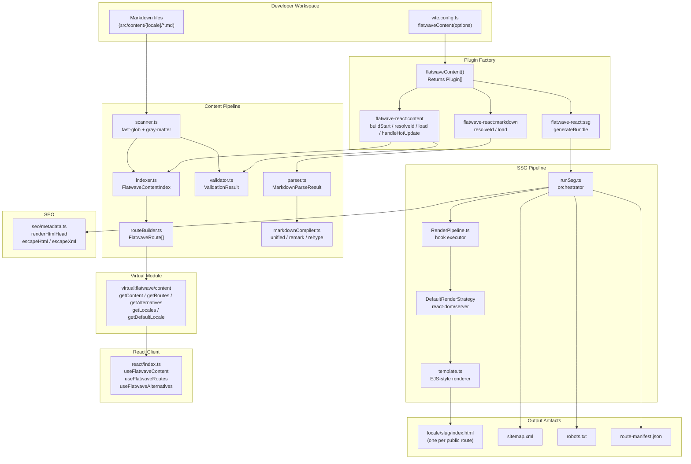

---

## Module Breakdown

### Plugin Core (`index.ts`)

The entry point exports the `flatwaveContent(options)` factory which:

1. **Normalizes options** — fills in defaults for optional fields (`requiredFields`, `validateComponents`, `emitRouteManifest`, `emitSitemap`, `emitRobotsTxt`, `ssg`).
2. **Returns three plugin objects** that Vite integrates into its build pipeline.

```
flatwaveContent(options)
    │
    ├─► normalizeOptions(options)   fills in all optional defaults
    │
    ├─► Plugin 1: flatwave-react:content
    │       buildStart()    → buildIndex() + validateContent()
    │       resolveId()     → maps "virtual:flatwave/content" → "\0virtual:..."
    │       load()          → createVirtualModule(index, defaultLocale)
    │       handleHotUpdate() → re-runs buildIndex() on .md changes
    │
    ├─► Plugin 2: flatwave-react:markdown
    │       resolveId()     → resolves .md file paths
    │       load()          → parseMarkdown() + inferLocale() → ES module
    │
    └─► Plugin 3: flatwave-react:ssg
            generateBundle() → runSsg(index, options, assets) → emitFile()
```

**Virtual module content** (created in `createVirtualModule`):

The virtual module is a string of JavaScript containing the serialized content index and helper functions. It exports:

- `getContent(id, locale?)` — find one entry
- `getAllContent()` — full entry array
- `getRoutes(locale?)` — all or locale-filtered routes
- `getAlternatives(contentId, currentLocale)` — locale → path map (minus current)
- `getLocale(locale?)` — pass-through locale helper
- `getLocales()` — unique locale list derived from routes
- `getDefaultLocale()` — the configured default locale
- `flatwaveContentIndex` — full index object

---

### Content Pipeline

```
src/content/
├── scanner.ts       ← Discovers and parses all .md files
├── parser.ts        ← Parses a single markdown string
├── indexer.ts       ← Builds the FlatwaveContentIndex
├── routeBuilder.ts  ← Assembles routes and SEO metadata
├── validator.ts     ← Runs all validation rules
└── markdownCompiler.ts ← Converts Markdown body → HTML
```

**`scanner.ts`**

Uses `fast-glob` to glob `**/*.md` inside each locale directory. For each file:

- reads content via `fs/promises`
- parses front-matter with `gray-matter`
- normalizes the slug (strips leading/trailing slashes, prepends `/`)
- returns an array of `ParsedMarkdownFile`

**`indexer.ts`**

Iterates `ParsedMarkdownFile[]`, creates `FlatwaveContentEntry` objects, builds an alternatives map (`id → { locale → route }`), then delegates to `buildContentIndex()` from `routeBuilder.ts`.

**`routeBuilder.ts`**

- Filters to public entries only
- Builds `byId` and `byLocale` lookup maps
- Assembles `FlatwaveRoute[]` sorted by `locale + path`
- Derives `SeoMetadata` from frontmatter fields

**`validator.ts`**

Runs five validation passes (all async):

1. **Required fields** — checks every entry has all `requiredFields`
2. **Duplicate IDs** — ensures no two files share the same `locale:id` key
3. **Duplicate slugs** — ensures no two files share the same `locale:slug` key
4. **Menu positions** — validates numeric `menu_position` values and uniqueness per menu group
5. **Components** — discovers `.tsx/.ts/.jsx/.js` files in `componentsDir` and checks that every `component` referenced in frontmatter exists

Returns `{ errors: string[], warnings: string[] }`. Errors block the build; warnings are surfaced via Vite's `this.warn()`.

**`markdownCompiler.ts`**

A `unified` pipeline:

```
unified()
  .use(remarkParse)           ← Markdown AST
  .use(remarkRehype, ...)     ← convert to HTML AST
  .use(rehypeRaw)             ← (optional) allow raw HTML passthrough
  .use(rehypeStringify)       ← serialize to HTML string
```

Accepts custom `remarkPlugins` and `rehypePlugins` via `MarkdownCompilerOptions`.

---

### SSG Pipeline

```
src/ssg/
├── runSsg.ts              ← main orchestrator
├── RenderPipeline.ts      ← hook phase executor
├── DefaultRenderStrategy.tsx ← react-dom/server renderer
├── template.ts            ← HTML template resolution + rendering
├── types.ts               ← RenderContext, TemplateVariables
├── index.ts               ← public exports
└── templates/
    ├── index.html.ejs      ← default HTML shell
    ├── entry-client.tsx.ejs
    └── entry-server.tsx.ejs
```

**`runSsg.ts`**

Processes all routes in **concurrency batches of 4**:

```
For each route (batched, 4 at a time):
  1. Find contentEntry matching route.contentId + route.locale
  2. pipeline.executeBeforeRender(context)     ← hook
  3. pipeline.executeTransformMarkdown(body)  ← hook
  4. compileMarkdownToHtml(transformedMarkdown) ← remark/rehype
  5. strategy.render(renderContext)            ← DefaultRenderStrategy / custom
  6. resolveTemplate('index.html', overrides) ← built-in or project-override
  7. renderHtmlHead(route)                     ← SEO meta tags
  8. renderTemplate(template, variables)       ← EJS-style substitution
  9. pipeline.executeTransformHtml(finalHtml)  ← hook
  10. pipeline.executeAfterRender(finalHtml)   ← hook (side effects only)
  11. Emit as 'asset' file: {locale}/{slug}/index.html

After all routes:
  → emit route-manifest.json (if enabled)
  → emit sitemap.xml        (if enabled)
  → emit robots.txt         (if enabled)
```

**`RenderPipeline.ts`**

Stores hooks per phase in typed arrays. Each `execute*` method runs hooks sequentially, wrapping each in try/catch to prevent one failing hook from aborting the whole render. Hook phases:

| Method                     | Phase               | Input → Output                  |
| -------------------------- | ------------------- | ------------------------------- |
| `executeBeforeRender`      | `beforeRender`      | `RenderContext → RenderContext` |
| `executeTransformMarkdown` | `transformMarkdown` | `(md, ctx) → md`                |
| `executeTransformHtml`     | `transformHtml`     | `(html, ctx) → html`            |
| `executeAfterRender`       | `afterRender`       | `(html, ctx) → void`            |
| `executeOnError`           | `onError`           | `(Error, ctx) → html`           |

**`DefaultRenderStrategy.tsx`**

- Looks up the React component from the preloaded `components` Map
- If component found: calls `renderToString(<Component {...props} />)`
- If component not found: falls back to returning the compiled HTML body directly (graceful degradation)
- Props passed to component: `{ ...frontmatter, markdownHtml, locale, route }`

**`template.ts`**

Resolution order for `index.html`:

1. `overrides.indexHtml` (if provided in `ssg.template`)
2. `{projectRoot}/flatwave-templates/index.html` (project-level override)
3. Built-in `templates/index.html.ejs`

Template substitution variables: `<%= appHtml %>`, `<%= title %>`, `<%= meta %>`, `<%= locale %>`, `<%= canonical %>`, `<%= headTags %>`, `<%= scripts %>`, `<%= styles %>`.

---

### React Client Layer

```
src/react/index.ts
```

Thin wrapper around the virtual module. Exports React hooks built with `useMemo` for referential stability:

| Hook                                   | Returns                               | Purpose                             |
| -------------------------------------- | ------------------------------------- | ----------------------------------- |
| `useFlatwaveContent(id, locale?)`      | `FlatwaveVirtualContent \| undefined` | Get one content entry               |
| `useFlatwaveRoutes(locale?)`           | `FlatwaveVirtualRoute[]`              | Get all routes, optionally filtered |
| `useFlatwaveAlternatives(id, locale?)` | `Record<string, string>`              | Locale → path map for a content ID  |
| `useFlatwaveLocales()`                 | `string[]`                            | All configured locales              |
| `useFlatwaveLocale(locale?)`           | `string \| undefined`                 | Pass-through locale value           |

Also re-exports the raw virtual module functions for non-hook usage (`getAllContent`, `getContent`, `getRoutes`, `getAlternatives`, `getLocale`, `getLocales`).

---

### SEO Module

```
src/seo/metadata.ts
```

| Function                     | Purpose                                                               |
| ---------------------------- | --------------------------------------------------------------------- |
| `renderHtmlHead(route)`      | Generates all `<meta>`, `<link>`, `<script>` tags from route metadata |
| `buildSeoMetadata(metadata)` | Utility for standalone head tag generation                            |
| `escapeHtml(value)`          | Escapes `&`, `<`, `>`, `"`, `'` for HTML attributes                   |
| `escapeXml(value)`           | Extends `escapeHtml` for XML contexts (sitemap)                       |
| `escapeJsonScript(value)`    | Escapes JSON-LD content for safe inline `<script>` injection          |

Generates tags for: `description`, `robots`, `canonical`, `og:*`, `twitter:*`, `hreflang` alternates, `application/ld+json`.

---

### CLI Tool

```
src/cli/validate.ts
```

Uses [Commander.js](https://github.com/tj/commander.js) to expose `flatwave-validate` as a CLI command:

```
flatwave-validate
  --content-dir <dir>       required
  --locales <locales>       required, comma-separated
  --default-locale <locale> required
  --components-dir <dirs>   optional, comma-separated (default: src/components,src/pages)
  --strict-missing          flag: missing locale variants → errors instead of warnings
  --no-validate-components  flag: skip component existence check
```

Internally calls `validateContent()` from the same validator the plugin uses, guaranteeing parity between CI and dev-time validation. Exit code 0 = pass, 1 = errors found.

---

## Data Flow Diagrams

### Build-time Data Flow

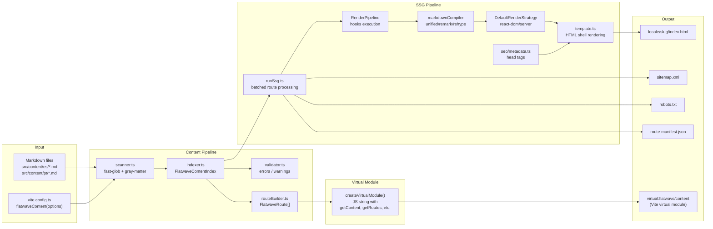

### Virtual Module Flow

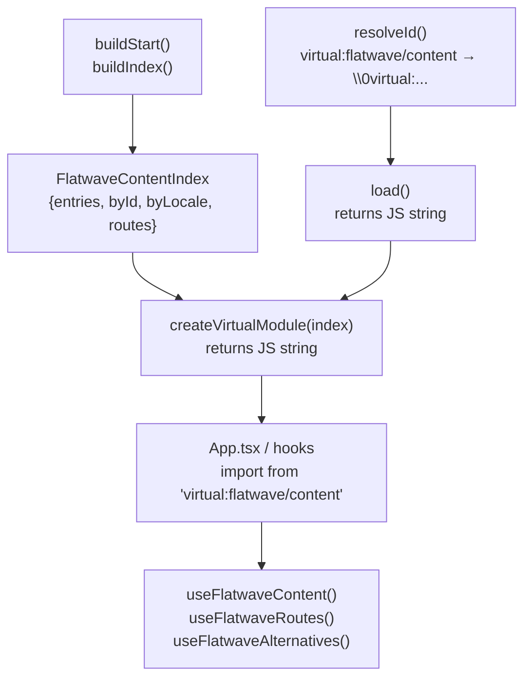

### SSG Rendering Pipeline

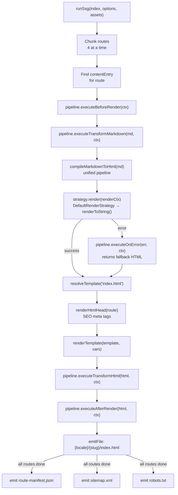

---

## Sequence Diagrams

### Plugin Initialization Sequence

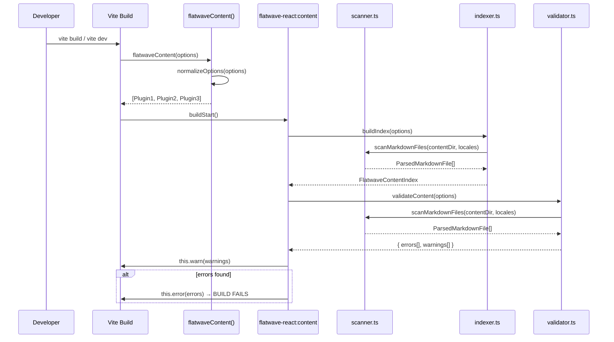

### Content Indexing Sequence

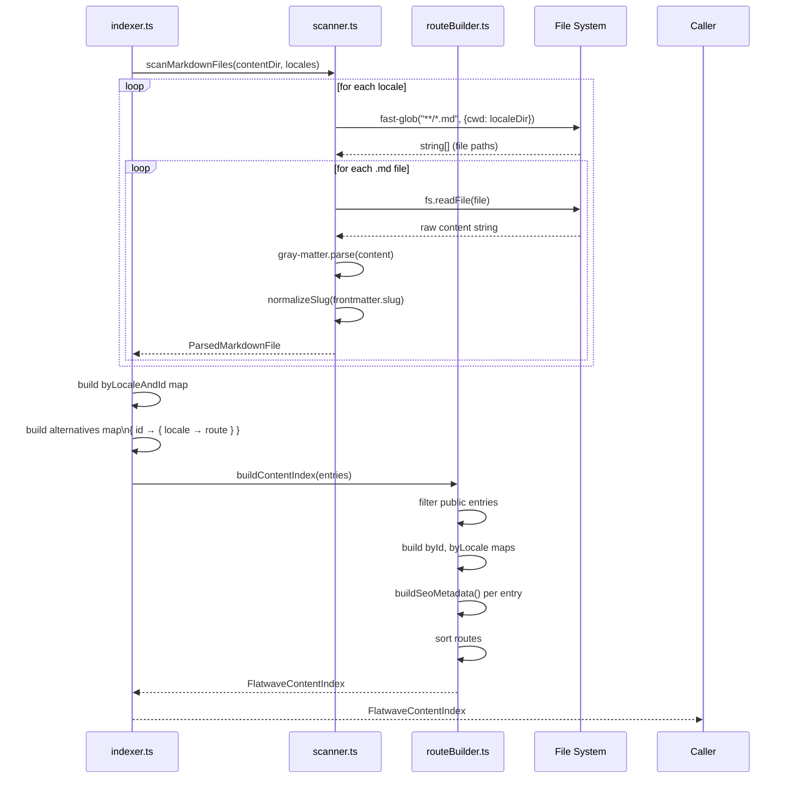

### SSG Page Rendering Sequence

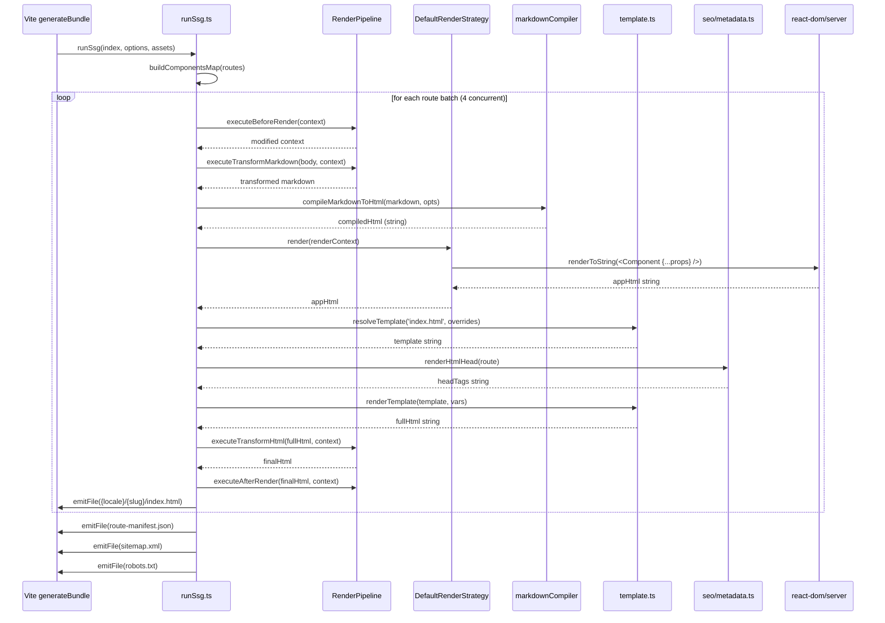

### Hot Module Replacement Sequence

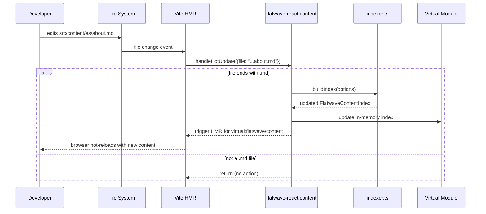

### CLI Validation Sequence

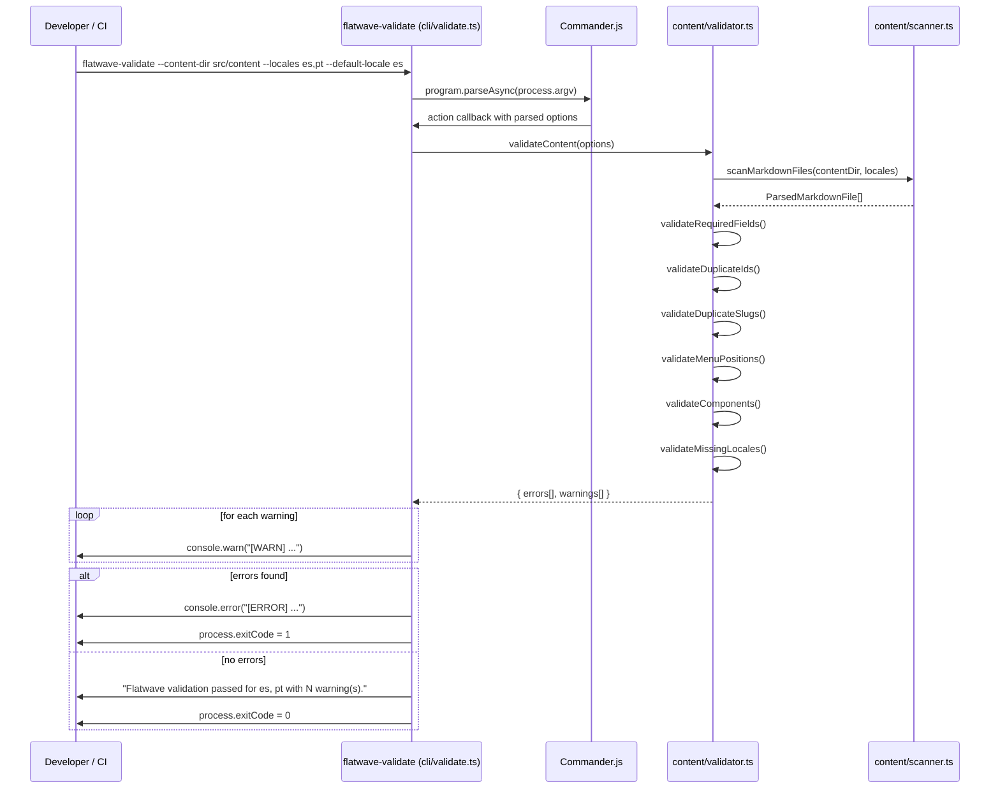

---

## Type System

The entire type system is centralized in `packages/vite-plugin-flatwave-react/src/types.ts`. Below are the primary interfaces and their relationships:

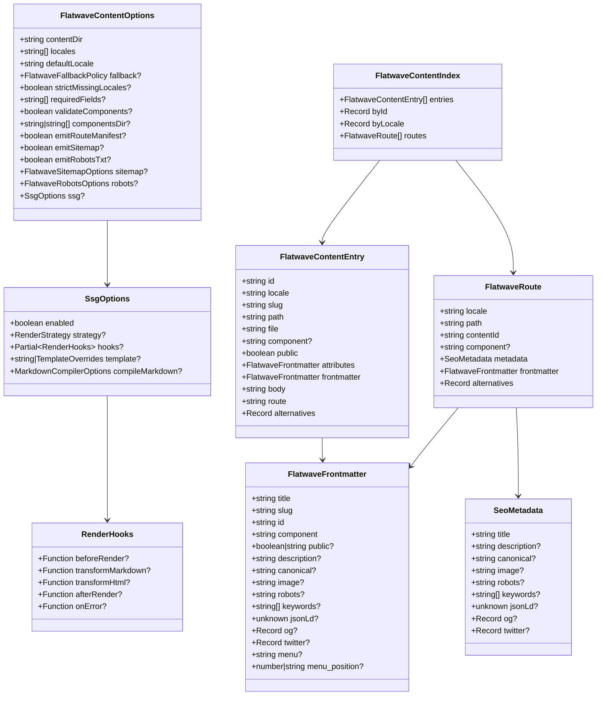

---

## Interrelationship Map

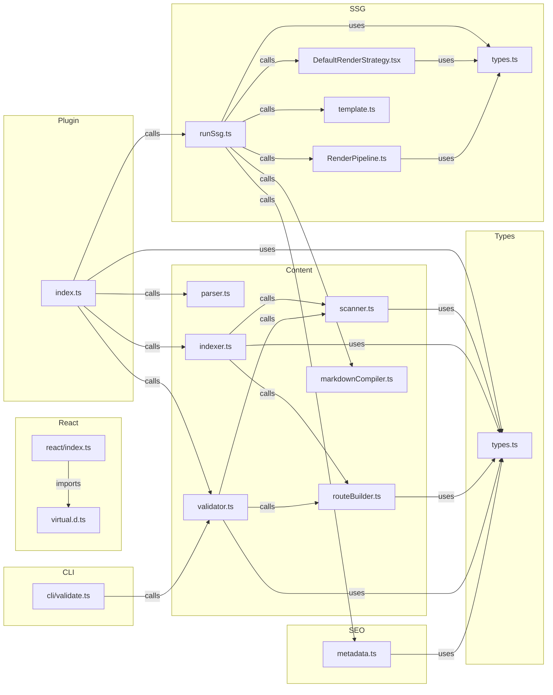

---

## Glossary

| Term                                       | Definition                                                                                                                                                                                                                      |
| ------------------------------------------ | ------------------------------------------------------------------------------------------------------------------------------------------------------------------------------------------------------------------------------- |
| **Virtual Module**                         | A Vite concept where a module ID (e.g. `virtual:flatwave/content`) resolves to in-memory generated JavaScript rather than a physical file on disk. The null-byte prefix `\0` is the Vite convention to mark virtual module IDs. |
| **Front-matter**                           | YAML metadata block at the top of a Markdown file, delimited by `---`. Parsed by `gray-matter` into a structured object.                                                                                                        |
| **Content Index (`FlatwaveContentIndex`)** | The central in-memory data structure holding all parsed content entries, lookup maps by ID and locale, and the full route list. Built once at `buildStart` and reused for virtual module generation and SSG.                    |
| **Content Entry (`FlatwaveContentEntry`)** | A single localized content item representing one `.md` file. Contains parsed frontmatter, raw Markdown body, computed route, and alternative locale routes.                                                                     |
| **Route (`FlatwaveRoute`)**                | A URL path derived from a content entry's locale and slug. Holds SEO metadata and the component name to use for rendering. Only public entries generate routes.                                                                 |
| **Slug**                                   | The URL segment for a page, specified in frontmatter. Normalized to always have a leading `/`. The homepage is recognized as `/` or `/index`.                                                                                   |
| **Locale**                                 | A language/region identifier string (e.g. `es`, `pt`, `en-US`). Content files live under `contentDir/{locale}/`. Routes are prefixed with `/{locale}/`.                                                                         |
| **SSG (Static Site Generation)**           | The process of pre-rendering React components to HTML strings at build time, producing static `.html` files that can be served by any web server without a Node.js runtime.                                                     |
| **Render Pipeline**                        | An ordered sequence of hook functions executed around the page rendering process. Hooks can transform the render context, markdown source, HTML output, and handle errors.                                                      |
| **Render Strategy**                        | An object implementing the `RenderStrategy` interface (`render(context): Promise<string>`). The default strategy uses `react-dom/server`'s `renderToString`. Custom strategies can be swapped in via `ssg.strategy`.            |
| **Render Context (`RenderContext`)**       | The data object passed to all hook phases and the render strategy. Contains the route, content entry, component map, asset references, and pipeline reference.                                                                  |
| **Hook Phase**                             | One of five lifecycle points in the SSG pipeline: `beforeRender`, `transformMarkdown`, `transformHtml`, `afterRender`, `onError`.                                                                                               |
| **Template**                               | An HTML file using EJS-style `<%= variable %>` placeholders. Defaults to the built-in `index.html.ejs`. Can be overridden per-project via `flatwave-templates/index.html`.                                                      |
| **Content Pipeline**                       | The sequence of scanner → indexer → routeBuilder + validator that converts raw `.md` files into a structured content index.                                                                                                     |
| **Alternatives**                           | A `Record<string, string>` mapping each locale to the corresponding route path for the same content ID. Used to generate `hreflang` `<link>` tags and build language switchers.                                                 |
| **Route Manifest**                         | `route-manifest.json` — a JSON file emitted alongside the static HTML that lists all generated routes. Useful for SSR adapters, CDN configuration, and other post-processing tools.                                             |
| **Sitemap**                                | `sitemap.xml` — a standard XML file listing all public routes for search engine crawlers.                                                                                                                                       |
| **Robots**                                 | `robots.txt` — a standard file indicating crawl permissions and the location of the sitemap.                                                                                                                                    |
| **OIDC (Trusted Publishing)**              | A security mechanism that allows npm packages to be published from GitHub Actions without storing long-lived `NPM_TOKEN` secrets. GitHub generates a short-lived identity token that npm exchanges for publish credentials.     |
| **Conventional Commits**                   | A commit message convention (`type(scope): description`) used to drive automated semantic versioning. See https://www.conventionalcommits.org.                                                                                  |
| **semantic-release**                       | An automated release management tool that reads commit messages, calculates the next version, publishes the npm package, creates a git tag, and generates a GitHub Release.                                                     |
| **Husky**                                  | A tool that installs Git hooks into `.husky/`. Used here to run `lint-staged` on `pre-commit` and `commitlint` on `commit-msg`.                                                                                                 |
| **lint-staged**                            | Runs linters (ESLint, Prettier) only on staged files, making the pre-commit hook fast regardless of project size.                                                                                                               |
| **fast-glob**                              | A high-performance glob library used by the scanner to discover Markdown files across locale directories.                                                                                                                       |
| **gray-matter**                            | A library that parses YAML/TOML front-matter from the beginning of a string, returning `{ data, content }`.                                                                                                                     |
| **unified / remark / rehype**              | A collection of composable text processing tools. `remark` processes Markdown AST; `rehype` processes HTML AST; `unified` is the processor that chains them together.                                                           |
| **ESM (ES Modules)**                       | The standard JavaScript module system using `import`/`export` syntax. The entire project is `"type": "module"` and outputs ESM-only artifacts.                                                                                  |
| **Workspace (npm workspaces)**             | An npm feature allowing multiple packages to live in the same repository with shared `node_modules`. This repo has two workspaces: the plugin package and the example app.                                                      |
| **Peer Dependency**                        | A dependency that the consumer project must install. The plugin declares `vite`, `react`, and `react-dom` as peers, meaning it doesn't bundle them but expects them to be available in the consumer's environment.              |
| **Commander.js**                           | The CLI framework used by `flatwave-validate` to parse arguments and subcommands.                                                                                                                                               |
