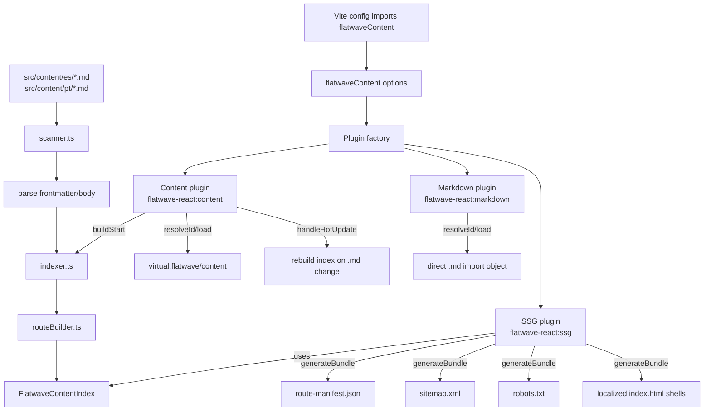
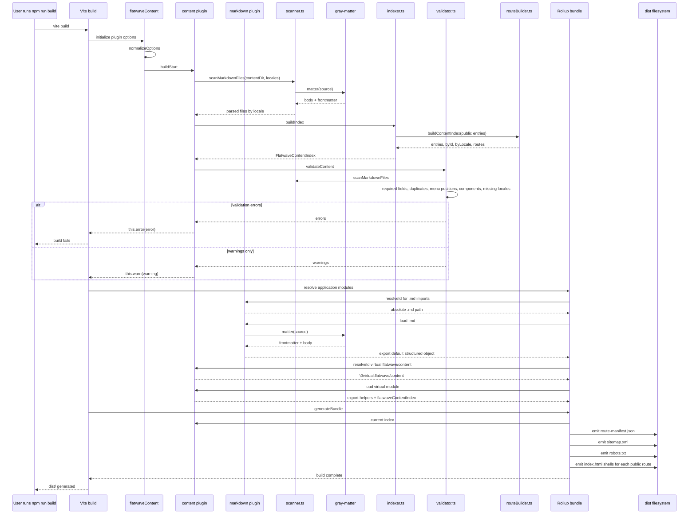
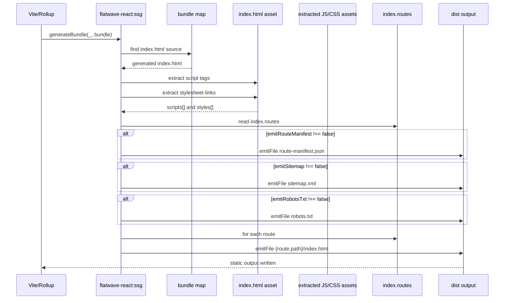
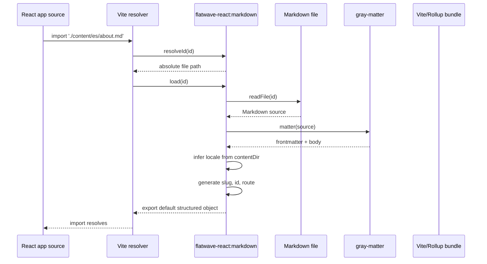
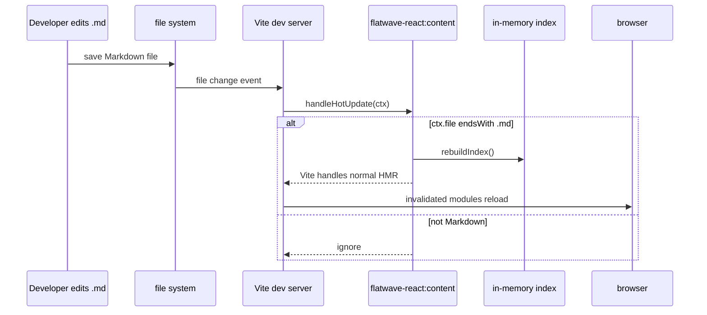
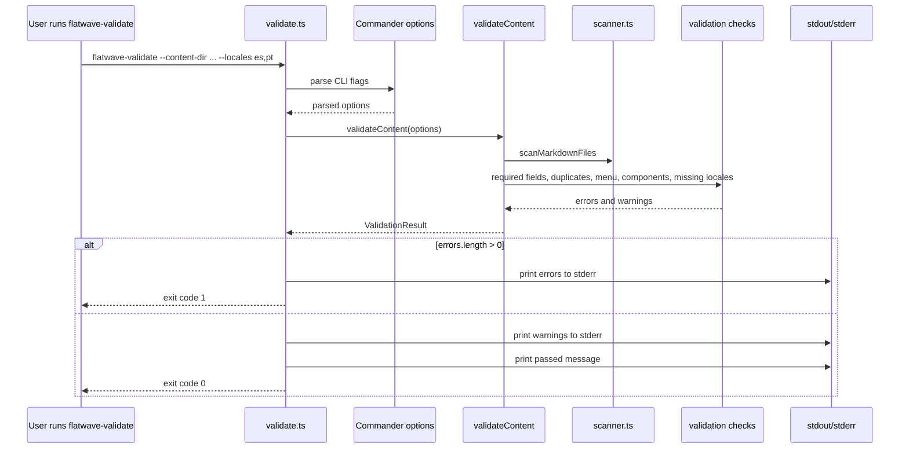
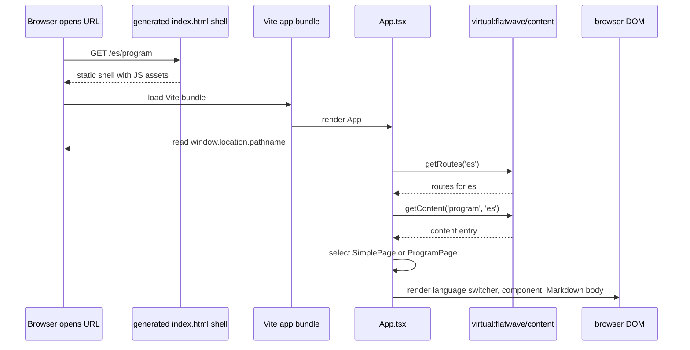

# Current Implemented Plugin Architecture

This document describes the architecture that is implemented today in `vite-plugin-flatwave-react`. It focuses on the current code in the plugin package, the example site, and the generated build output.

## 1. Scope

The plugin is a Vite content and static-output plugin for Markdown-driven, locale-prefixed React sites. Its current responsibilities are:

- Scan Markdown files from locale-specific directories.
- Parse Markdown frontmatter and body with `gray-matter`.
- Validate frontmatter, duplicate content IDs, duplicate slugs, menu positions, component names, and missing locale variants.
- Build an in-memory content index grouped by content ID and locale.
- Expose a virtual module named `virtual:flatwave/content` for React code.
- Allow direct `.md` imports as structured content objects.
- Generate route metadata and static site assets during Vite build:
  - `route-manifest.json`
  - `sitemap.xml`
  - `robots.txt`
  - one locale-prefixed `index.html` file per public route

Important current limitation: the plugin generates localized static HTML shells and injects route metadata into `<head>`, but it does not server-render React components or Markdown body content into those HTML files. The example React app still reads the browser URL at runtime and renders content client-side.

## 2. Package and Source Layout

Relevant source files:

| Area             | File                                                                                                                                    | Responsibility                                                                                                     |
| ---------------- | --------------------------------------------------------------------------------------------------------------------------------------- | ------------------------------------------------------------------------------------------------------------------ |
| Plugin factory   | [`packages/vite-plugin-flatwave-react/src/index.ts`](../packages/vite-plugin-flatwave-react/src/index.ts)                               | Creates the Vite plugin array, normalizes options, exposes virtual modules, renders build assets.                  |
| Types            | [`packages/vite-plugin-flatwave-react/src/types.ts`](../packages/vite-plugin-flatwave-react/src/types.ts)                               | Defines options, content entries, routes, SEO metadata, and validation result types.                               |
| Markdown scanner | [`packages/vite-plugin-flatwave-react/src/content/scanner.ts`](../packages/vite-plugin-flatwave-react/src/content/scanner.ts)           | Discovers Markdown files per locale and parses frontmatter/body.                                                   |
| Parser           | [`packages/vite-plugin-flatwave-react/src/content/parser.ts`](../packages/vite-plugin-flatwave-react/src/content/parser.ts)             | Parses raw Markdown source for direct `.md` imports.                                                               |
| Indexer          | [`packages/vite-plugin-flatwave-react/src/content/indexer.ts`](../packages/vite-plugin-flatwave-react/src/content/indexer.ts)           | Builds normalized content entries and locale alternatives.                                                         |
| Route builder    | [`packages/vite-plugin-flatwave-react/src/content/routeBuilder.ts`](../packages/vite-plugin-flatwave-react/src/content/routeBuilder.ts) | Converts public entries into route inventory and SEO metadata.                                                     |
| Validator        | [`packages/vite-plugin-flatwave-react/src/content/validator.ts`](../packages/vite-plugin-flatwave-react/src/content/validator.ts)       | Runs content validation and component discovery.                                                                   |
| SEO metadata     | [`packages/vite-plugin-flatwave-react/src/seo/metadata.ts`](../packages/vite-plugin-flatwave-react/src/seo/metadata.ts)                 | Escapes values and renders head tags such as canonical, robots, alternate links, Open Graph, Twitter, and JSON-LD. |
| React hooks      | [`packages/vite-plugin-flatwave-react/src/react/index.ts`](../packages/vite-plugin-flatwave-react/src/react/index.ts)                   | Provides React hooks backed by the virtual module.                                                                 |
| CLI              | [`packages/vite-plugin-flatwave-react/src/cli/validate.ts`](../packages/vite-plugin-flatwave-react/src/cli/validate.ts)                 | Runs the same validation logic as the Vite plugin.                                                                 |
| Virtual types    | [`packages/vite-plugin-flatwave-react/src/virtual.d.ts`](../packages/vite-plugin-flatwave-react/src/virtual.d.ts)                       | Declares TypeScript types for `virtual:flatwave/content`.                                                          |

The package entry points are defined in [`packages/vite-plugin-flatwave-react/package.json`](../packages/vite-plugin-flatwave-react/package.json):

```json
{
  ".": {
    "types": "./dist/index.d.ts",
    "import": "./dist/index.js"
  },
  "./react": {
    "types": "./dist/react/index.d.ts",
    "import": "./dist/react/index.js"
  },
  "./seo": {
    "types": "./dist/seo/metadata.d.ts",
    "import": "./dist/seo/metadata.js"
  },
  "./validation": {
    "types": "./dist/content/validator.d.ts",
    "import": "./dist/content/validator.js"
  },
  "./types": {
    "types": "./dist/types.d.ts"
  }
}
```

## 3. High-Level Architecture

The plugin is implemented as a factory function that returns three Vite plugins:

1. `flatwave-react:content`
2. `flatwave-react:markdown`
3. `flatwave-react:ssg`



## 4. Plugin Hook Matrix

| Plugin                    | Hook              | Current behavior                                                                                                                                                                  |
| ------------------------- | ----------------- | --------------------------------------------------------------------------------------------------------------------------------------------------------------------------------- |
| `flatwave-react:content`  | `buildStart`      | Calls `buildIndex()` and `validateContent()`. Emits warnings through `this.warn()` and errors through `this.error()`.                                                             |
| `flatwave-react:content`  | `resolveId`       | Resolves the public virtual import `virtual:flatwave/content` to the internal ID `\0virtual:flatwave/content`.                                                                    |
| `flatwave-react:content`  | `load`            | Returns generated JavaScript source that exports content helpers and the full index.                                                                                              |
| `flatwave-react:content`  | `handleHotUpdate` | Rebuilds the index when a changed file ends with `.md`.                                                                                                                           |
| `flatwave-react:markdown` | `resolveId`       | Resolves `.md` imports to an absolute path based on `process.cwd()`.                                                                                                              |
| `flatwave-react:markdown` | `load`            | Parses `.md` files and returns an ES module whose default export is `{ body, attributes, frontmatter, locale, slug, id, route, file }`.                                           |
| `flatwave-react:ssg`      | `generateBundle`  | Emits `route-manifest.json`, `sitemap.xml`, `robots.txt`, and one static HTML file per public route. It also extracts JS/CSS asset references from Vite's generated `index.html`. |

## 5. Configuration Model

The options type is defined in [`src/types.ts`](../packages/vite-plugin-flatwave-react/src/types.ts). The example configuration is in [`examples/basic-react-site/vite.config.ts`](../examples/basic-react-site/vite.config.ts).

```ts
flatwaveContent({
  contentDir: path.resolve(__dirname, 'src/content'),
  locales: ['es', 'pt'],
  defaultLocale: 'es',
  strictMissingLocales: false,
  componentsDir: path.resolve(__dirname, 'src/components'),
  sitemap: {
    hostname: 'http://localhost:4173',
  },
});
```

### Option defaults and current behavior

| Option                                    | Default / current behavior                                                                                                        |
| ----------------------------------------- | --------------------------------------------------------------------------------------------------------------------------------- |
| `contentDir`                              | Required. Root directory containing locale folders such as `es/` and `pt/`.                                                       |
| `locales`                                 | Required. Locale folders that are scanned.                                                                                        |
| `defaultLocale`                           | Required. Must be included in `locales`. Currently used only by `getDefaultLocale()` and validation.                              |
| `requiredFields`                          | Defaults to `['title', 'slug', 'id', 'component', 'public']`.                                                                     |
| `validateComponents`                      | Defaults to `true`.                                                                                                               |
| `componentsDir`                           | Defaults to `['src/components', 'src/pages']` inside the validator when `validateComponents` is enabled and no value is supplied. |
| `strictMissingLocales`                    | Defaults to `false`. When `true`, missing-locale warnings become build errors.                                                    |
| `fallback`                                | Typed, but not currently used by the implementation.                                                                              |
| `emitRouteManifest`                       | Defaults to `true`.                                                                                                               |
| `emitSitemap`                             | Defaults to `true`.                                                                                                               |
| `emitRobotsTxt`                           | Defaults to `true`.                                                                                                               |
| `sitemap.hostname`                        | Defaults to `http://localhost:4173`. Used for sitemap URLs and `robots.txt`.                                                      |
| `sitemap.changefreq` / `sitemap.priority` | Typed, but currently ignored. The generated sitemap always uses `weekly` and `0.8`.                                               |
| `robots`                                  | Typed, but currently ignored. The generated `robots.txt` always allows all paths and points to `sitemap.xml`.                     |

## 6. Content Discovery and Normalization

### File layout

The current scanner expects this layout:

```text
src/content/
  es/
    index.md
    about.md
    program.md
  pt/
    index.md
    about.md
    program.md
```

Each locale folder is scanned recursively with `fast-glob` using the pattern `**/*.md`.

### Frontmatter fields

Baseline fields used by the plugin:

| Field                    | Purpose                                                                                           |
| ------------------------ | ------------------------------------------------------------------------------------------------- |
| `title`                  | Page title and SEO `<title>`. Required by default.                                                |
| `slug`                   | URL segment. Required by default. If missing, the file basename is used.                          |
| `id`                     | Content identity used to group translations. Required by default. If missing, the slug is used.   |
| `component`              | React component name referenced by the example app. Required by default.                          |
| `public`                 | Controls whether the entry appears in the route index and generated outputs. Required by default. |
| `description`            | SEO description.                                                                                  |
| `canonical`              | Canonical URL. Defaults to the generated route path.                                              |
| `robots`                 | Robots meta value. Defaults to `index, follow`.                                                   |
| `keywords`               | Array of keywords.                                                                                |
| `image`                  | Open Graph and Twitter image URL.                                                                 |
| `jsonLd`                 | JSON-LD object inserted as a script tag.                                                          |
| `og`                     | Open Graph metadata object.                                                                       |
| `twitter`                | Twitter Card metadata object.                                                                     |
| `menu` / `menu_position` | Validated as a unique menu position per locale.                                                   |

Additional frontmatter fields are preserved in `attributes` and `frontmatter`, allowing component-specific fields such as `date` and `schedule` in the example.

### Route generation

Route generation is implemented in [`scanner.ts`](../packages/vite-plugin-flatwave-react/src/content/scanner.ts) and [`routeBuilder.ts`](../packages/vite-plugin-flatwave-react/src/content/routeBuilder.ts).

Rules:

1. `slug` is normalized by trimming leading and trailing slashes and adding a leading slash.
2. Home routes are detected when the normalized slug is `/` or `/index`.
3. Home routes become `/{locale}/`.
4. Non-home routes become `/{locale}{slug}`.
5. The default locale is not treated specially. With `defaultLocale: 'es'`, the default locale still renders under `/es/...`.

Examples:

| Locale | Slug      | Generated path |
| ------ | --------- | -------------- |
| `es`   | `index`   | `/es/`         |
| `es`   | `about`   | `/es/about`    |
| `pt`   | `program` | `/pt/program`  |

## 7. Content Index and Route Inventory

The core data structure is `FlatwaveContentIndex`:

```ts
interface FlatwaveContentIndex {
  entries: FlatwaveContentEntry[];
  byId: Record<string, Record<string, FlatwaveContentEntry>>;
  byLocale: Record<string, Record<string, FlatwaveContentEntry>>;
  routes: FlatwaveRoute[];
}
```

The index is built in two phases:

1. `indexer.ts` scans all locale folders, parses Markdown, builds content entries, and assigns `alternatives`.
2. `routeBuilder.ts` filters public entries and converts them into route objects with SEO metadata.

### `FlatwaveContentEntry`

```ts
interface FlatwaveContentEntry {
  id: string;
  locale: string;
  slug: string;
  path: string;
  file: string;
  component?: string;
  public: boolean;
  attributes: FlatwaveFrontmatter;
  frontmatter: FlatwaveFrontmatter;
  body: string;
  route: string;
  alternatives: Record<string, string>;
}
```

### `FlatwaveRoute`

```ts
interface FlatwaveRoute {
  locale: string;
  path: string;
  contentId: string;
  component?: string;
  metadata: SeoMetadata;
  frontmatter: FlatwaveFrontmatter;
  alternatives: Record<string, string>;
}
```

### Example route inventory

For the example site, the generated route inventory contains six routes:

```text
/es/
/es/about
/es/program
/pt/
/pt/about
/pt/program
```

The full generated example is available at [`examples/basic-react-site/dist/route-manifest.json`](../examples/basic-react-site/dist/route-manifest.json).

## 8. Virtual Module API

The content plugin exposes `virtual:flatwave/content`. This virtual module is generated from the in-memory index and exports helper functions plus the raw index.

### Generated exports

```ts
getContent(id, locale?)
getAllContent()
getRoutes(locale?)
getAlternatives(contentId, currentLocale)
getLocale(locale)
getLocales()
getDefaultLocale()
flatwaveContentIndex
```

### Helper behavior

| Export                                      | Behavior                                                                                         |
| ------------------------------------------- | ------------------------------------------------------------------------------------------------ |
| `getContent(id, locale?)`                   | Returns the first entry whose `id` matches. If `locale` is provided, the locale must also match. |
| `getAllContent()`                           | Returns all public content entries.                                                              |
| `getRoutes(locale?)`                        | Returns all public routes. If `locale` is provided, filters to that locale.                      |
| `getAlternatives(contentId, currentLocale)` | Returns the alternative routes for a content ID, excluding the current locale.                   |
| `getLocale(locale)`                         | Returns the passed locale value.                                                                 |
| `getLocales()`                              | Returns the unique locale values from routes.                                                    |
| `getDefaultLocale()`                        | Returns the configured `defaultLocale`.                                                          |
| `flatwaveContentIndex`                      | Exports the complete generated index object.                                                     |

The TypeScript declaration for this module is in [`src/virtual.d.ts`](../packages/vite-plugin-flatwave-react/src/virtual.d.ts).

## 9. React Adapter

The React entry point is [`packages/vite-plugin-flatwave-react/src/react/index.ts`](../packages/vite-plugin-flatwave-react/src/react/index.ts). It exports memoized hooks backed by the virtual module.

```ts
import {
  useFlatwaveContent,
  useFlatwaveRoutes,
  useFlatwaveAlternatives,
  useFlatwaveLocales,
  useFlatwaveLocale,
} from 'vite-plugin-flatwave-react/react';
```

The example app uses the lower-level virtual module directly:

```ts
import { getRoutes, getContent } from 'virtual:flatwave/content';
```

The example app route selection is implemented in [`examples/basic-react-site/src/App.tsx`](../examples/basic-react-site/src/App.tsx):

1. It reads the first path segment from `window.location.pathname`.
2. It calls `getRoutes(locale)`.
3. It finds the route whose `path` matches the current browser path.
4. It falls back to the first route in that locale if no exact match is found.
5. It loads content with `getContent(route.contentId, locale)`.
6. It selects `ProgramPage` or `SimplePage` based on `content.component`.

## 10. Direct Markdown Import

The `flatwave-react:markdown` plugin allows imports like:

```ts
import content from './content/es/about.md';
```

The loaded module exports:

```ts
export default {
  body: string;
  attributes: FlatwaveFrontmatter;
  frontmatter: FlatwaveFrontmatter;
  locale: string;
  slug: string;
  id: string;
  route: string;
  file: string;
};
```

Current implementation notes:

- The Markdown body is not compiled to HTML or React.
- The import is parsed with `gray-matter`.
- Locale is inferred from the path relative to `contentDir`.
- The route is generated from locale and slug.
- The `id` value is the file slug, not necessarily the frontmatter `id`.

## 11. Validation Architecture

Validation is run during `buildStart` and by the standalone CLI.

### Validation checks

| Check                                              | Error or warning                                              |
| -------------------------------------------------- | ------------------------------------------------------------- |
| Missing required frontmatter fields                | Error                                                         |
| Duplicate content ID within a locale               | Error                                                         |
| Duplicate slug within a locale                     | Error                                                         |
| Duplicate `menu` + `menu_position` within a locale | Error                                                         |
| `menu_position` is not numeric when `menu` is set  | Error                                                         |
| Referenced component does not exist                | Error, unless disabled                                        |
| Content ID missing in a locale                     | Warning by default; error when `strictMissingLocales` is true |
| No public routes generated                         | Warning                                                       |

### Component discovery

Component validation is intentionally simple. It reads the top-level files in each configured component directory and collects file basenames without extensions.

For example, with `componentsDir: src/components`, these files are considered valid component names:

```text
SimplePage.tsx  -> SimplePage
ProgramPage.tsx -> ProgramPage
```

Nested component directories are not currently discovered.

## 12. SEO and Static Output Rendering

SEO metadata is built from frontmatter in `routeBuilder.ts` and rendered in `seo/metadata.ts`.

### Metadata fields

| Frontmatter    | Generated output                                                                      |
| -------------- | ------------------------------------------------------------------------------------- |
| `title`        | `<title>` and default description fallback.                                           |
| `description`  | `<meta name="description">`.                                                          |
| `canonical`    | `<link rel="canonical">`. Defaults to the generated route path.                       |
| `robots`       | `<meta name="robots">`. Defaults to `index, follow`.                                  |
| `image`        | `<meta property="og:image">` and `<meta name="twitter:image">`.                       |
| `og`           | One `<meta property="og:{key}">` per entry.                                           |
| `twitter`      | One `<meta name="twitter:{key}">` per entry.                                          |
| `jsonLd`       | `<script type="application/ld+json">`.                                                |
| `alternatives` | `<link rel="alternate" hreflang="{locale}" href="{route}">` for every locale variant. |

The SSG plugin emits localized HTML files under:

```text
dist/
  es/
    index.html
    about/
      index.html
    program/
      index.html
  pt/
    index.html
    about/
      index.html
    program/
      index.html
  route-manifest.json
  sitemap.xml
  robots.txt
```

Each generated HTML file contains:

- `<!doctype html>`
- `<html lang="{locale}">`
- charset and viewport meta tags
- localized `<title>`
- localized description meta tag
- canonical link
- route-specific SEO tags from `renderHtmlHead`
- extracted CSS asset links from Vite's `index.html`
- extracted JS asset script tags from Vite's `index.html`
- `<div id="root"></div>`

Current limitation: the generated HTML shell does not contain the React-rendered page body or Markdown content. It is a static, localized, SEO-aware shell that loads the Vite application assets.

## 13. Build-Time Flow

### Complete build sequence



### `generateBundle` sequence



### Direct Markdown import sequence



### Development HMR sequence



## 14. Standalone Validation CLI Flow

The validation CLI is built from [`src/cli/validate.ts`](../packages/vite-plugin-flatwave-react/src/cli/validate.ts) and uses the same `validateContent()` function as the Vite plugin.



## 15. Runtime Application Flow

Although this document focuses on build-time behavior, the runtime flow is important because the current plugin exposes data to the client.



## 16. Example Build Output

The example site configured in [`examples/basic-react-site/vite.config.ts`](../examples/basic-react-site/vite.config.ts) produces the following route set:

```json
[
  { "locale": "es", "path": "/es/", "contentId": "home", "component": "SimplePage" },
  { "locale": "es", "path": "/es/about", "contentId": "about", "component": "SimplePage" },
  { "locale": "es", "path": "/es/program", "contentId": "program", "component": "ProgramPage" },
  { "locale": "pt", "path": "/pt/", "contentId": "home", "component": "SimplePage" },
  { "locale": "pt", "path": "/pt/about", "contentId": "about", "component": "SimplePage" },
  { "locale": "pt", "path": "/pt/program", "contentId": "program", "component": "ProgramPage" }
]
```

The generated HTML for `/es/program` contains the localized route shell:

```html
<!doctype html>
<html lang="es">
  <head>
    <meta charset="UTF-8" />
    <meta name="viewport" content="width=device-width, initial-scale=1.0" />
    <title>Programa</title>
    <meta
      name="description"
      content="Página de programa con frontmatter específico del componente."
    />
    <link rel="canonical" href="/es/program" />
    <meta
      name="description"
      content="Página de programa con frontmatter específico del componente."
    />
    <meta name="robots" content="index, follow" />
    <link rel="canonical" href="/es/program" />
    <link rel="alternate" hreflang="es" href="/es/program" />
    <link rel="alternate" hreflang="pt" href="/pt/program" />
  </head>
  <body>
    <div id="root"></div>
  </body>
</html>
```

The generated sitemap uses the configured hostname and includes every public route:

```xml
<urlset xmlns="http://www.sitemaps.org/schemas/sitemap/0.9">
  <url><loc>http://localhost:4173/es/</loc></url>
  <url><loc>http://localhost:4173/es/about</loc></url>
  <url><loc>http://localhost:4173/es/program</loc></url>
  <url><loc>http://localhost:4173/pt/</loc></url>
  <url><loc>http://localhost:4173/pt/about</loc></url>
  <url><loc>http://localhost:4173/pt/program</loc></url>
</urlset>
```

## 17. Current Implementation Notes and Gaps

These items are intentionally called out because they affect how the current architecture should be understood.

| Area                    | Current state                                                                                                                                    |
| ----------------------- | ------------------------------------------------------------------------------------------------------------------------------------------------ |
| Default locale behavior | The default locale is still prefixed. There is no unprefixed default route such as `/about`.                                                     |
| Fallback policy         | `fallback` is typed but not implemented. Missing locale variants are reported as warnings or strict errors, but content fallback is not applied. |
| Sitemap customization   | `sitemap.changefreq` and `sitemap.priority` are typed but ignored. The sitemap always uses `weekly` and `0.8`.                                   |
| Robots customization    | The `robots` option is typed but ignored. The plugin always emits `User-agent: *`, `Allow: /`, and the sitemap URL.                              |
| Markdown rendering      | Markdown is parsed but not transformed into HTML or React. Rendering is the application's responsibility.                                        |
| Static HTML generation  | The plugin emits localized HTML shells, not fully server-rendered React page markup.                                                             |
| HMR                     | Markdown edits rebuild the index, but the plugin does not explicitly add watch files or manually invalidate virtual modules.                     |
| Component validation    | Only top-level component files in configured directories are discovered.                                                                         |
| Direct `.md` imports    | The `id` returned by direct Markdown imports is the file slug, not necessarily the frontmatter `id`.                                             |

## 18. Build Commands

The root workspace scripts are defined in [`package.json`](../package.json).

| Command                    | Purpose                                                                                    |
| -------------------------- | ------------------------------------------------------------------------------------------ |
| `npm run build:plugin`     | Builds the plugin package with TypeScript into `packages/vite-plugin-flatwave-react/dist`. |
| `npm run build:example`    | Builds the example React site using the plugin.                                            |
| `npm run build`            | Builds the plugin and then the example site.                                               |
| `npm run validate:example` | Runs the standalone validation CLI against the example content.                            |
| `npm run test:e2e`         | Builds the plugin and example, serves `dist`, and runs Vitest e2e checks.                  |

## 19. Summary

The current architecture is a compact Vite-native content layer. It scans locale-specific Markdown, validates it, builds a content and route index, exposes that index through a virtual module, and emits static route assets during build. The example app consumes the virtual module at runtime to select localized content and render Markdown client-side.

The most important architectural boundary is that the plugin owns content discovery, validation, virtual module generation, route inventory, and static metadata assets. It does not currently own React rendering, Markdown-to-React compilation, browser language detection, fallback content resolution, or full server-side pre-rendering.
